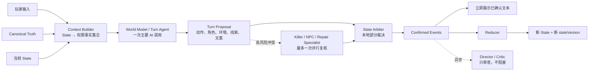

# AI-first World Model + State Arbiter 架构交接

> - 状态：目标架构，尚未完整实现
> - 用途：交给新对话继续设计、拆分计划并实施重构
> - 当前实现入口：参见 `docs/architecture-current.md`

## 1. 背景与问题定义

当前项目的很多剧情 Bug 并不是某一个 fallback 分支写错，而是系统同时存在多套事实权威：

- Parser AI 和中文关键词 fallback 都在解释玩家意图；
- StoryNode 可以在玩家动作执行前短路整个回合；
- Killer Agent 的策略只验证 JSON 结构，缺少语义前置条件审核；
- Narrator 文本可能反向成为动态线索来源；
- 固定线索模板可能写入玩家没有实际观察到的内容；
- 推荐行动可能依据未确认事实或与安全边界冲突；
- 多个 Agent 串行调用会让一次玩家输入等待数分钟。

典型实测问题包括：

1. 玩家在 23:00 只检查包裹，Killer Agent 却选择备用钥匙强入，规则层直接确认，玩家在 23:02 死亡。
2. 玩家输入“反锁、扣门链、用行李箱堵门”，行动叙事却编造拆包裹和三行数字纸条，并将虚构纸条写入线索栏和推荐行动。
3. 玩家明确“只拍外包装、不翻内部”，固定剧情节点只播放林越撤回消息，吞掉拍照动作，没有更新照片、电量和相关 State。
4. fallback 将“不打开门，隔门询问”误判为“冲出房门”。

这些问题不能靠继续增加关键词、StoryNode 分支或固定文案彻底解决。每迎合一种输入方式，就可能破坏另一种表达。

## 2. 已确认的架构方向

采用 **B+C 自适应架构**：

- **World Model / Turn Agent** 负责 AI-first 的语义理解和整回合提案；
- **State Arbiter** 负责通用权限、可见性、能力、因果和一致性裁决；
- **Reducer** 只根据 Confirmed Events 生成新 State；
- 普通回合只进行一次阻塞式 AI 调用；
- 高风险回合才升级为独立 Specialist Agent 并行复核；
- Arbiter 默认部分接受和局部裁剪，不因小错误重做整回合；
- Director / Critic 异步运行，不阻塞玩家。

这里的“以 AI API 返回为准”是指：

- 玩家语义、角色决策、环境推进、线索提案和显示内容以 AI 为主要生成来源；
- 不再用中文关键词 fallback 试图覆盖所有表达；
- 但 AI 返回的是 **Proposal**，不能直接修改 State；
- State 只有在 Proposal 通过通用世界约束后才能更新。

## 3. 三层事实权威

### 3.1 Canonical Truth：不可变世界真相

Canonical Truth 定义这个故事中不能被 AI 改写的内容，例如：

- 主角、NPC 身份和人物关系；
- 包裹的真实来源；
- 林越不知道幕后真相；
- 陈怀民和赵鸿远的关系；
- 公寓空间结构和已有物品；
- 23:47 在主线中的意义；
- 当前版本允许存在的 Ending 类型。

AI 可以决定这些真相通过什么现象、在什么节奏下逐步暴露，但不能改写真相。

### 3.2 AI Turn Proposal：本回合智能提案

World Model 根据玩家输入、Canonical Truth 摘要、当前 State 和权限事实集合，提出：

- 玩家动作及动作范围；
- 明确的否定条件和动作顺序；
- Killer、NPC 和环境反应；
- 时间、电量、位置、物品和威胁变化；
- 玩家可能观察到的事实；
- 候选线索；
- 推荐行动；
- 与候选事件绑定的显示文本。

Turn Proposal 不是正式事实。

### 3.3 Confirmed State：正式游戏事实

State Arbiter 将合法提案转换为 Confirmed Events，Reducer 再据此生成新 State。

Narrator、Clue、Recommender、Sidebar 和下一回合 Context 都只能把 Confirmed Events / Confirmed State 当作事实来源。

## 4. 目标回合主链路



普通回合的唯一主要等待是 World Model API。Context Builder、Arbiter 和 Reducer 都是本地过程。

## 5. Context Builder 的职责

Context Builder **不是 Agent，也不解析玩家自然语言**。

它只负责把固定格式的 State 转换成权限明确的 Fact 集合：

```text
Fact:
  id
  subject
  predicate
  value
  sourceEventId
  visibleTo
  knownBy
  validFromTurn
  invalidatedBy
```

示例：

```text
fact.front_door.chain_locked
  value: true
  sourceEventId: event.player.secured_door
  visibleTo: [player]
  knownBy: [player]

fact.linyue.received_package_photo
  value: true
  sourceEventId: event.message.delivered.to_linyue
  visibleTo: [player, linyue]
  knownBy: [player, linyue]

fact.killer.knows_photo_shared
  value: false
  visibleTo: [system]
  knownBy: [system]
```

同一个 State 会生成不同权限投影：

- `PlayerContext`：玩家可见物品、已知线索、记忆、消息和可感知环境；
- `KillerContext`：Killer Knowledge、可观察公共事件和自身历史行动；
- `NpcContext`：每个 NPC 实际收到的内容和自身知识；
- `WorldModelContext`：完整世界结构及带 `knownBy` / `visibleTo` 标签的事实。

玩家长句由 World Model / Parser 逻辑解析。Context Builder 不读取“先”“不要”“只”“然后”等中文关键词。

Context 选择优先依据当前状态，而非玩家文字匹配：

- 玩家当前位置和相邻空间；
- 当前可见实体和持有物；
- 活跃通信对象；
- 最近 Confirmed Events；
- 未解决威胁和行动；
- 仍有效的关键线索；
- 当前剧情阶段摘要；
- 远端实体的轻量索引。

## 6. World Model / Turn Agent

World Model 是普通回合唯一阻塞式 AI 调用。逻辑上的 Parser、Killer、NPC、Environment、Clue、Narrator 和 Recommender 可以作为它的 Prompt 模块和结构化输出区段，而不必每个都进行一次串行 API 调用。

它需要正确处理：

- 长句和复合动作；
- 动作先后顺序；
- 否定条件；
- 观察范围；
- 指代对象；
- 玩家明确禁止的动作；
- 各 Actor 的知识边界；
- 候选状态变化和因果依赖。

示例输入：

> 我先不开门，只拍包裹外面的收件标记，把照片发给林越并提醒他不要上楼，然后反锁、扣门链，再打开手机录音。

提案需要保留：

```text
orderedActions:
  1. photograph(package, scope=exterior.label)
  2. send_message(linyue, attachment=action_1.photo)
  3. secure(front_door, effects=[lock, chain_lock])
  4. record(phone)

globalConstraints:
  - must_not_open_door
  - must_not_open_package
```

World Model 不直接返回任意 State Patch，只能提出结构化事件和效果。

## 7. Turn Proposal 核心契约

每个提案至少需要携带：

```text
Proposal:
  id
  actorId
  operation
  targetIds
  basedOnFactIds
  preconditions
  forbiddenScopes
  proposedEffects
  observations
  visibility
  confidence
  causalParentIds
  clueCandidates
  recommendations
  displayFragments
```

关键要求：

- Agent 之间不能通过自由叙事正文建立事实；
- Actor 的行动必须引用其有权读取的 `basedOnFactIds`；
- 结果必须能回溯到前置事件；
- 候选线索必须引用 Observation Event；
- 推荐行动必须引用玩家可见 Confirmed Event；
- 显示文本必须按原子事件拆分，并携带 `eventRefs` / `claimRefs`。

## 8. State Arbiter 规划

### 8.1 Arbiter 不做什么

Arbiter 不负责：

- 解析玩家中文；
- 决定剧情应该紧张还是平静；
- 选择 Killer 应该短信、敲门还是强入；
- 生成 NPC 台词；
- 生成线索内容；
- 文学化环境描写；
- 推荐下一步行动；
- 根据某个角色、钟点或具体句子写剧情分支。

### 8.2 Arbiter 只检查通用世界规律

#### 实体约束

- Actor、目标和物品必须存在；
- 物品必须处于可访问位置；
- 同一实体不能同时出现在冲突位置；
- 未声明实体不能凭空进入正式 State。

#### 能力约束

- Actor 或工具必须拥有对应 capability；
- 手机没电不能完成拍照或通信；
- 未打开或不可见区域不能被观察；
- 工具只能绕过其声明支持的障碍。

#### 知识约束

- `basedOnFactIds` 必须存在且未失效；
- 当前 Actor 必须拥有读取权限；
- 私密 Fact 不能成为 Killer / NPC 行动依据；
- 全局真相存在，不等于 Actor 已经知道。

#### 因果约束

- 每个结果必须引用导致它的事件；
- 上游事件被拒绝时，下游依赖事件自动失效；
- Death / Ending 必须能回溯到完整合法因果链。

#### 可见性约束

- Observation 必须声明感官、来源、距离和遮挡；
- 线索内容只能是实际观察字段的子集；
- 玩家不可见事件不能出现在玩家文本和推荐依据中。

#### 冲突约束

- 包裹未打开但观察到内部内容；
- 消息发送失败但 NPC Knowledge 已更新；
- 门链仍在但 Actor 已无阻碍进入；
- 未拾取物品但已经使用；
- 同一事务中 mutually exclusive 状态同时成立。

#### 不可逆结果约束

以下候选结果统一标记为 `irreversible`，需要更严格的来源和因果验证：

- 玩家或 NPC 死亡；
- Ending；
- 关键线索；
- 证据销毁；
- NPC 被捕、逃离或永久失能；
- 永久 Knowledge 更新。

### 8.3 组件能力组合，避免剧情 if/else

门不写成“23:02 时陈怀民不能用备用钥匙杀人”，而是声明组件：

```text
frontDoor.barriers = [lock, chain, barricade]
spareKey.canBypass = [lock]
spareKey.cannotBypass = [chain, barricade]
```

任何 Actor 使用任何钥匙尝试进入，都通过相同能力组合计算结果。

不接受这种规则：

```text
如果玩家说“不打开门”，就不要让陈怀民进入。
```

接受这种规则：

```text
actor_entered 只有在所有有效入口障碍被解除后才能确认。
```

每条 Arbiter 规则必须满足：

1. 不依赖某句自然语言；
2. 不依赖某个具体剧情角色；
3. 至少适用于一类世界实体、能力或状态关系。

### 8.4 部分提交，不循环重生成

Arbiter 输出：

```text
StateTransitionResult:
  acceptedEvents
  correctedEvents
  rejectedEffects
  violations
  requiresRepair
  requiresPlayerClarification
  outputStateVersion
```

例如 AI 提出：

- 门已反锁；
- 行李箱堵门；
- 包裹里出现数字纸条；
- Killer 使用备用钥匙进入；
- 玩家死亡。

Arbiter 应：

- 接受反锁和堵门；
- 拒绝无 Observation 来源的数字纸条；
- 将成功进入裁决为进入尝试失败；
- 因因果链断裂而拒绝死亡；
- 不重新生成整个回合。

只有关键结果无法局部修复时，才进行最多一次 Specialist Repair。再次失败后保留合法事件，不形成重试循环。

## 9. Reducer 与异步提交

Reducer 只接受 Confirmed Events，不读取玩家自然语言和 AI 原始文本。

它负责：

- 更新门、窗、包裹、手机、位置和持有物；
- 结算时间、电量、威胁等资源；
- 更新 NPC / Killer Knowledge；
- 写入合法线索；
- 更新阶段和 Ending；
- 递增 `stateVersion`；
- 持久化 State。

State Arbiter 完成后，可以立即把已确认的显示文本发送给前端。Reducer、Fact Ledger、Knowledge Projection、存档和 Critic 在玩家阅读时完成。

每回合必须带版本：

```text
turnId
inputStateVersion
outputStateVersion
```

下一次玩家输入开始处理前，必须满足新 State 已提交，防止并发回合读取旧状态或旧响应覆盖新状态。

## 10. 显示文本与 Event 引用

原始 AI 流式文本不能在 Arbiter 裁决前直接展示。可以流式接收，但必须先在服务端缓冲。

World Model 返回原子化文本：

```text
displayFragments:
  - text: 门外传来钥匙插入锁芯的轻响。
    eventRefs: [event.key_inserted]

  - text: 门锁转开，门板向内移动。
    eventRefs: [event.door_unlocked, event.door_opened]

  - text: 那个人进入房间。
    eventRefs: [event.actor_entered]
```

若 Arbiter 只确认 `event.key_inserted`，则只展示第一段。被拒绝事件对应的文本、线索和推荐必须一起删除。

Narrator 文本永远不能作为 State 或 Clue 的事实来源。

## 11. Clue 与 Recommendation 边界

Clue Candidate 必须提供：

```text
claims
basedOnObservationIds
visibleFactIds
confidence
```

Arbiter 验证 `claims` 是 Observation 内容的子集。

只拍外包装时，可以生成标签、外观和破损信息，不能生成旧书、药盒或内部纸条。

Recommendation 必须引用最终玩家可见的 Confirmed Events，并满足：

- 不重复已经完成的动作；
- 不依据幕后身份；
- 不把 NPC 建议当作事实；
- 不推荐当前状态下不可执行或明显危险的行为；
- 依据事件被拒绝时，对应建议一起删除。

## 12. Agent 调用与延迟预算

逻辑 Agent 不等于独立串行 API 调用。

### 普通回合

```text
Context Builder（本地）
→ World Model / Turn Agent（一次阻塞式 AI）
→ State Arbiter（本地）
→ 立即展示已确认文本
→ Reducer / Context / Persist / Critic（阅读期间并行）
```

### 高风险回合

只有这些情况允许增加一次 Specialist 并行复核：

- Death / Ending；
- 关键线索；
- NPC 身份或重要 Knowledge 变化；
- Killer 强入；
- 多 Actor 提案严重冲突；
- Arbiter 裁剪后没有任何有效事件。

Repair 只修复被拒绝部分，不重新解析玩家动作，不重做完整回合，最多一次。

### 异步任务

不阻塞玩家：

- Director / Critic；
- 回合摘要；
- Agent Trace 整理；
- 详细 Sidebar；
- 音效选择；
- 下一回合 Context 预热；
- Prompt 质量指标记录。

## 13. 迁移计划

避免一次性推倒现有主链路，采用影子运行和逐步接管。

### 阶段 1：契约与事实层

- 定义 `Fact`、`Proposal`、`ConfirmedEvent`、`StateTransitionResult`；
- 建立 Fact Ledger；
- 建立 Player / Killer / NPC Knowledge Projection；
- 保持现有流程不变。

### 阶段 2：只读 Shadow Arbiter

- Arbiter 读取现有回合结果；
- 输出“如果由 Arbiter 裁决会接受/拒绝什么”；
- 暂不影响正式 State；
- 收集误判、漏判和 Prompt 越界数据。

### 阶段 3：接管低风险状态

- 观察范围；
- 普通物品；
- 拍照；
- 通信；
- 门锁和门链；
- 时间和电量。

### 阶段 4：接管 Knowledge 与 Clue

- 所有 Knowledge 更新必须来自 Confirmed Event；
- 所有 Clue 必须引用 Observation；
- 禁止 Narrator 正文反向生成动态线索。

### 阶段 5：接管高风险结果

- Killer 行动；
- 强入和攻击；
- NPC 永久状态；
- Death / Ending；
- 关键证据销毁。

### 阶段 6：退出旧硬编码主路径

- 移除 StoryNode 对玩家动作的短路；
- 将固定剧情节点降级为 Canonical Story Material / 阶段目标；
- 将中文关键词 fallback 退出正式 AI 主链路；
- fallback 只保留为 AI 服务完全不可用时的最低可玩模式；
- 删除已经由通用 capability / invariant 覆盖的剧情分支。

## 14. 测试策略

重构必须先补失败测试，再写实现。

测试重点不是穷举中文句子，而是验证结构化世界性质：

- 任意 Actor 在门链未解除时都不能确认进入；
- 任意外包装 Observation 都不能获得内部字段；
- 私密 Fact 永远不能成为 Killer 的合法行动依据；
- 删除必要 Fact 后，所有依赖提案必须失败；
- 被拒绝事件不能留下 State、Clue、Recommendation 或显示文本；
- 消息未送达时 NPC Knowledge 不得更新；
- 任意 Ending 都必须能回溯到合法因果链；
- 无关 Fact 的增加不应改变裁决结果；
- 独立事件交换顺序后最终 State 应保持一致；
- 相同结构化 Proposal 不应因玩家原句改写而改变裁决。

应增加：

- 属性测试；
- 状态组合生成测试；
- 越权 Proposal 对抗测试；
- Knowledge Projection 泄露测试；
- 并发 `stateVersion` 测试；
- 真实 AI 端到端剧情回归；
- Arbiter Shadow 结果与正式结果对照指标。

## 15. 可观测性与调优指标

每回合记录：

- Agent Proposal；
- Proposal 使用的 Fact IDs；
- Arbiter accepted / corrected / rejected 结果；
- 拒绝原因和因果链；
- Specialist Repair 是否触发；
- Prompt 版本；
- State 输入输出版本；
- AI 延迟、Arbiter 延迟、Reducer 延迟；
- 虚构实体、知识越界、观察越界、线索无来源等分类指标。

重点监控：

- Agent Proposal 拒绝率；
- 高风险 Repair 触发率；
- 无有效事件回合率；
- Clue 拒绝率；
- Knowledge 越界率；
- 普通回合 AI 调用次数；
- 玩家可见首个确认结果时间。

## 16. 非目标

本次架构优化不以这些事情为目标：

- 用 Arbiter 编写完整剧情；
- 用更多硬编码让 fallback 理解所有自然语言；
- 让每个逻辑 Agent 都进行一次独立串行 API 调用；
- 让 Critic 反复修改已确认 State；
- 用 Narrator 文本替代事件和状态；
- 一次性删除全部现有实现并重写。

## 17. 新对话接手建议

新对话开始后应：

1. 先阅读本文件和 `docs/architecture-current.md`；
2. 对照当前 `resolveTurnHarness()`、DomainEvent、ContextBuilder、KillerKnowledge 和动态线索路径；
3. 先写契约和失败测试计划，不直接大改实现；
4. 采用 Shadow Arbiter，避免一次性替换正式状态管线；
5. 每完成一个迁移阶段都运行完整测试、类型检查和真实剧情回归；
6. 只有验证稳定后才删除旧路径。

建议新对话的首个任务：

> 基于 `docs/ai-first-world-model-arbiter-handoff.md` 和 `docs/architecture-current.md`，审计现有类型、DomainEvent、ContextBuilder 与 resolveTurnHarness 主链路，输出阶段 1 的详细实施计划：需要新增或修改的文件、契约字段、失败测试、兼容策略和验证命令。先不要写实现代码。
