# AI-first World Model + State Arbiter 架构交接

> - 状态：目标架构，阶段一与阶段二 Shadow Run 已实现，阶段三及以后尚未接管
> - 用途：交给新对话继续设计、拆分计划并实施重构
> - 当前实现入口：参见 `docs/architecture-current.md`
> - 迁移记录：参见 `docs/ai-first-phase-1-implementation.md` 与 `docs/ai-first-phase-2-implementation.md`
> - Hackathon 当前实施范围：参见 `docs/architecture-mvp.md`；未达到其中的复杂度升级门槛前，不实施本文档的生产级扩展

## 1. 背景与问题定义

当前项目的很多剧情 Bug 并不是某一个 fallback 分支写错，而是系统同时存在多套事实权威：

- Parser AI 和中文关键词 fallback 都在解释玩家意图；
- StoryNode 可以在玩家动作执行前短路整个回合；
- Killer Agent 的策略只验证 JSON 结构，缺少语义前置条件审核；
- Narrator 文本可能反向成为动态线索来源；
- 固定线索模板可能写入玩家没有实际观察到的内容；
- 推荐行动可能依据未确认事实或与安全边界冲突；
- 多个 Agent 串行调用会让一次玩家输入等待数分钟。

典型实测问题包括：

1. 玩家在 23:00 只检查包裹，Killer Agent 却选择备用钥匙强入，规则层直接确认，玩家在 23:02 死亡。
2. 玩家输入“反锁、扣门链、用行李箱堵门”，行动叙事却编造拆包裹和三行数字纸条，并将虚构纸条写入线索栏和推荐行动。
3. 玩家明确“只拍外包装、不翻内部”，固定剧情节点只播放林越撤回消息，吞掉拍照动作，没有更新照片、电量和相关 State。
4. fallback 将“不打开门，隔门询问”误判为“冲出房门”。

这些问题不能靠继续增加关键词、StoryNode 分支或固定文案彻底解决。每迎合一种输入方式，就可能破坏另一种表达。

## 2. 已确认的架构方向

采用 **B+C 自适应架构**：

- **Fast Semantic Compiler** 先把玩家自然语言编译成轻量、稳定的共享 `TurnBrief`；
- **World Model / Turn Agent** 根据 `TurnBrief` 负责完整的首选整回合提案；
- **Player / Killer / NPC / Environment / Clue / Recommendation Specialist** 每回合全部并行运行，提供权限隔离的领域候选和原子显示片段；
- **State Arbiter** 负责通用权限、可见性、能力、因果和一致性裁决，输出尚未提交的 `StateTransitionResult`；
- **Reducer** 只根据已通过裁决的事件批计算候选新 State；事件批与新 State 通过版本校验并原子提交后，才成为 Confirmed Events / Confirmed State；
- 玩家可见关键路径由“短 Semantic Compiler 等待 + 主 World Model 必要等待 + Specialist 热备按需等待”组成；
- Arbiter 按“接受主提案 → 局部裁剪 → Specialist 替代 → 本地 fallback”的四层顺序处理，不因小错误重做整回合；
- 主 World Model 是创造性首选，Specialist 是领域热备；本地规则决定物理事实，不在合法候选之间投票；
- Director / Critic 异步运行，不阻塞玩家。

这里的“以 AI API 返回为准”是指：

- 玩家语义、角色决策、环境推进、线索提案和显示内容以 AI 为主要生成来源；
- 不再用中文关键词 fallback 试图覆盖所有表达；
- 但 AI 返回的是 **Proposal**，不能直接修改 State；
- State 只有在 Proposal 通过通用世界约束后才能更新。

## 3. 三层事实权威

### 3.1 Canonical Truth：不可变世界真相

Canonical Truth 定义这个故事中不能被 AI 改写的内容，例如：

- 主角、NPC 身份和人物关系；
- 包裹的真实来源；
- 林越不知道幕后真相；
- 陈怀民和赵鸿远的关系；
- 公寓空间结构和已有物品；
- 23:47 在主线中的意义；
- 当前版本允许存在的 Ending 类型。

AI 可以决定这些真相通过什么现象、在什么节奏下逐步暴露，但不能改写真相。

### 3.2 AI Turn Proposal：本回合智能候选

Semantic Compiler 先根据玩家原文和 `PlayerContext` 生成共享 `TurnBrief`。主 World Model 再根据 `TurnBrief`、Canonical Truth 摘要、当前 State 和权限事实集合提出完整首选回合；各 Specialist 根据最小权限投影并行提出领域候选：

- 玩家动作及动作范围；
- 明确的否定条件和动作顺序；
- Killer、NPC 和环境反应；
- 时间、电量、位置、物品和威胁变化；
- 玩家可能观察到的事实；
- 候选线索；
- 推荐行动；
- 与候选事件绑定的显示文本。

主 Turn Proposal 和 Specialist Candidate 都不是正式事实。

### 3.3 Confirmed State：正式游戏事实

State Arbiter 将合法提案转换为 `StateTransitionResult`，但“裁决通过”不等于“已经成为正式事实”。Reducer 根据其中已接受、已修正且通过高风险门槛的事件计算候选新 State；只有事件批与新 State 通过 `loopId`、`turnId` 和 `inputStateVersion` 校验并原子提交成功后，才成为 Confirmed Events / Confirmed State。

Narrator、Clue、Recommender、Sidebar 和下一回合 Context 都只能把 Confirmed Events / Confirmed State 当作事实来源。

### 3.4 事实生效与提交语义

正式事实的生命周期固定为：

```text
Proposal / SpecialistCandidate
→ StateTransitionResult（已裁决，未提交）
→ Reducer 计算候选新 State
→ Atomic Turn Commit
→ Confirmed Events + Confirmed State
→ 玩家可见文本与下游投影
```

所有回合请求共享最小信封：

```text
TurnEnvelope:
  loopId
  turnId
  inputStateVersion
  deadlineAt
```

提交结果至少包含：

```text
TurnCommitResult:
  loopId
  turnId
  inputStateVersion
  outputStateVersion
  commitStatus: committed | conflict | failed
  confirmedEventIds
```

只有 `commitStatus=committed` 时：

- 事件才允许被称为 Confirmed Event；
- 对应 `displayFragments` 才能发给玩家；
- Knowledge、Clue、Recommendation、Sidebar 和下一回合 Context 才能引用这些事件；
- `outputStateVersion` 才正式生效。

若版本冲突、循环已重置或持久化失败，本批事件不展示、不更新任何投影，也不能由迟到的异步任务补写。这里要求的是单回合原子提交边界，不要求当前阶段立即建设完整的通用事件溯源平台。

## 4. 目标回合主链路

```mermaid
flowchart LR
    Input["玩家输入"]
    Context["Context Builder<br/>State → 权限事实集合"]
    Canon["Canonical Truth"] --> Context
    State["当前 State"] --> Context

    Input --> Semantic["Fast Semantic Compiler<br/>短结构化调用"]
    Context -->|PlayerContext| Semantic
    Semantic --> Brief["共享 TurnBrief<br/>动作、顺序、否定、范围、Action IDs"]
    Brief --> Projector["Intent Projector<br/>本地最小权限投影"]
    Context --> Projector

    Projector --> Turn["Main World Model<br/>完整首选 Turn Proposal"]
    Projector --> Specialists["全部 Specialist 每回合并行<br/>Player / Killer / NPC / Environment / Clue / Recommendation"]
    Turn --> Proposal["Primary Proposal"]
    Specialists --> Candidates["领域候选池<br/>ranked candidates + display fragments"]

    Proposal --> Arbiter["State Arbiter<br/>四层本地裁决"]
    Candidates --> Arbiter
    Arbiter --> Result["StateTransitionResult<br/>已裁决，未提交"]
    Result --> Gate["High-Risk Gate<br/>双门槛"]
    Gate --> Reducer["Reducer<br/>计算候选新 State"]
    Reducer --> Commit["Atomic Turn Commit<br/>校验 loopId + stateVersion"]
    State --> Commit
    Commit --> Confirmed["Confirmed Events<br/>新 State + outputStateVersion"]
    Confirmed --> UI["展示已提交文本"]

    Confirmed -.异步.-> Critic["Director / Critic<br/>只审查，不阻塞"]
```



普通回合存在两个 AI 波次：先等待极短的 Semantic Compiler，再等待主 World Model 与 Specialist 热备候选。Context Builder、Intent Projector、Arbiter、High-Risk Gate、Reducer 和 Atomic Turn Commit 都是本地过程。第二波只等待主模型与当前裁决真正需要的返回，不以所有 Agent 全部完成为前提。

## 5. Context Builder、Semantic Compiler 与共享 Turn Brief

### 5.1 Context Builder 的职责

Context Builder **不是 Agent，也不解析玩家自然语言**。

它只负责把固定格式的 State 转换成权限明确的 Fact 集合：

```text
Fact:
  id
  subject
  predicate
  value
  sourceEventId
  visibleTo
  knownBy
  validFromTurn
  invalidatedBy
```

示例：

```text
fact.front_door.chain_locked
  value: true
  sourceEventId: event.player.secured_door
  visibleTo: [player]
  knownBy: [player]

fact.linyue.received_package_photo
  value: true
  sourceEventId: event.message.delivered.to_linyue
  visibleTo: [player, linyue]
  knownBy: [player, linyue]

fact.killer.knows_photo_shared
  value: false
  visibleTo: [system]
  knownBy: [system]
```

同一个 State 会生成不同权限投影：

- `PlayerContext`：玩家可见物品、已知线索、记忆、消息和可感知环境；
- `KillerContext`：Killer Knowledge、可观察公共事件和自身历史行动；
- `NpcContext`：每个 NPC 实际收到的内容和自身知识；
- `WorldModelContext`：完整世界结构及带 `knownBy` / `visibleTo` 标签的事实。

玩家长句由 Semantic Compiler 解析。Context Builder 不读取“先”“不要”“只”“然后”等中文关键词。

Context 选择优先依据当前状态，而非玩家文字匹配：

- 玩家当前位置和相邻空间；
- 当前可见实体和持有物；
- 活跃通信对象；
- 最近 Confirmed Events；
- 未解决威胁和行动；
- 仍有效的关键线索；
- 当前剧情阶段摘要；
- 远端实体的轻量索引。

### 5.2 Semantic Compiler 的职责

Semantic Compiler 和本地投影相邻，但职责不同：

- Context Builder 回答“这个角色现在有权知道什么”；
- Semantic Compiler 回答“玩家这句话究竟想做什么”；
- Intent Projector 回答“每个并行 Agent 可以收到 `TurnBrief` 的哪一部分”；
- Arbiter 回答“候选行动在当前世界中实际产生什么结果”。

Semantic Compiler 只读取玩家原文和紧凑 `PlayerContext`，负责：

- 拆分原子动作；
- 保留动作顺序和依赖；
- 提取否定条件、限定范围和明确禁止的动作；
- 解析指代、通信对象、候选附件和玩家希望的可见范围；
- 为动作和候选产物分配稳定 ID；
- 在影响状态的歧义无法安全缩小时请求玩家澄清。

它不负责 Killer / NPC 决策、动作成功与否、精确时间和电量、Observation、Clue、Recommendation、叙事、State Patch、Death 或 Ending。

### 5.3 共享 Turn Brief 契约

`TurnBrief` 是所有第二波 Agent 的共享语义锚点，但不等于正式事实：

```text
TurnBrief:
  loopId
  turnId
  inputStateVersion
  compilerVersion
  utteranceMode
  resolvedReferences
  orderedActions
  globalConstraints
  scopedConstraints
  communications
  candidateHandles
  ambiguities
```

每个 `orderedAction` 至少包含稳定 `actionId`、`actorId`、`operation`、`targetIds`、`scope`、`method`、`dependsOnActionIds`、候选输入输出句柄和对应的玩家原文范围。

候选句柄只描述依赖关系。例如 `candidate.photo.action_1` 只有在拍照事件被确认后才能成为正式实体。`stealthIntent`、`intendedAudience` 和 `desiredOutcome` 也只表达玩家意图，不能直接成为实际可见性或世界结果。

### 5.4 本地 Intent Projection

Semantic Compiler 返回后，本地 Intent Projector 根据 Context 和权限规则生成不同输入：

- 主 World Model：完整 `TurnBrief`、带权限标签的世界 Facts 和必要 Canonical Constraints；
- Player Specialist：完整玩家意图、PlayerContext、当前可访问实体和能力；
- Killer Specialist：只接收 KillerContext 与带前置条件的可观察信号候选，不接收玩家原文、完整 `TurnBrief` 或 PlayerContext；
- NPC Specialist：只接收自己的 NpcContext，以及以 `message_delivered` 为前置条件、明确发给自己的候选通信；
- Environment Specialist：只接收公共状态、环境能力和允许响应的事件锚点；
- Clue / Recommendation Specialist：只接收带 Observation / visible event 前置条件的候选锚点。

并行 Agent 可以对尚未确认的事件生成条件候选，但不能把条件候选当作已知事实。条件不成立时，对应候选、Knowledge、Clue、Recommendation 和显示文本一起失效。

### 5.5 Semantic Compiler 轻量化与失败策略

Semantic Compiler 位于所有第二波 API 的前置关键路径，必须作为延迟敏感型组件设计：

- 使用短 Prompt、严格 Schema、非思考模式和受控输出长度；
- 只发送玩家原文、紧凑 PlayerContext、当前实体别名索引和最近指代候选；
- 不注入 Canonical Truth、Killer / NPC Knowledge、完整剧情历史或长篇 World Info；
- 在上一回合 Reducer 提交后预热下一回合 PlayerContext 和实体索引；
- 静态系统 Prompt、操作枚举和 Schema 尽量使用缓存；
- 关键路径不自动串行重试。Compiler 失败时，主 World Model 直接接收原文降级处理，Specialist 只使用回合开始时已有的权限事实和保守条件候选。

建议以真实 API 回归确定模型，并把 Compiler 的 P95 延迟控制在主 World Model P95 的 10%～20% 内；若主模型通常需要数秒，Compiler 的工程目标应尽量接近或低于 1 秒。速度不能以丢失“只”“不要”“如果”“先……再……”为代价。

## 6. World Model / Turn Agent

主 World Model 接收共享 `TurnBrief` 和完整但带权限标签的 WorldModelContext，生成整回合的完整首选 Proposal。它仍然负责整体连贯性、跨领域因果图和首选显示内容，但不再独自承担玩家语义解析，也不是唯一的候选来源。

它需要正确处理：

- 忠实消费 `TurnBrief` 中已经确定的动作、顺序、否定、范围和指代；
- 各 Actor 的知识边界；
- 候选状态变化和因果依赖。

示例输入：

> 我先不开门，只拍包裹外面的收件标记，把照片发给林越并提醒他不要上楼，然后反锁、扣门链，再打开手机录音。

Semantic Compiler 需要先在 `TurnBrief` 中保留：

```text
orderedActions:
  1. photograph(package, scope=exterior.label)
  2. send_message(linyue, attachment=action_1.photo)
  3. secure(front_door, effects=[lock, chain_lock])
  4. record(phone)

globalConstraints:
  - must_not_open_door
  - must_not_open_package
```

World Model 不直接返回任意 State Patch，只能提出结构化事件和效果。

### 6.1 每回合全面并行的 Specialist

共享 `TurnBrief` 通过本地权限投影后，所有已配置 Specialist 每回合与主 World Model 同时运行：

- Player Specialist：玩家动作、候选效果和 Observation；
- Killer Specialist：只基于 KillerContext 的 2～3 个排序策略候选；
- NPC Specialist：只基于各自 NpcContext 的回复和行动候选；
- Environment Specialist：独立环境推进候选；
- Clue Specialist：只依赖候选 Observation IDs 的线索；
- Recommendation Specialist：只依赖候选玩家可见事件的建议。

每个 Specialist 都应为自己的候选携带原子 `displayFragments`，从而在主提案的对应领域失效时仍能优先使用 Agent 文本，而不是立即降级为生硬的本地文案。

并行 Specialist 看不到尚未返回的主 Proposal，因此它们不是当前回合的 Reviewer。它们的职责是提供权限隔离、窄契约的领域热备候选。真正检查完整主输出的 Director / Critic 必须在结果返回后异步运行，不能伪装成同一波的并行审查。

合法的主 World Model 候选始终优先于 Specialist。Arbiter 不在多个合法创意之间投票；只有主提案的对应根行为非法、缺失或因裁剪而无法继续时，才按排名尝试相同领域的 Specialist 候选。

## 7. Turn Proposal 核心契约

每个提案至少需要携带：

```text
Proposal:
  id
  loopId
  sourceAgent
  domain
  candidateRank
  turnBriefActionIds
  replacementFor
  actorId
  operation
  targetIds
  basedOnFactIds
  preconditions
  forbiddenScopes
  proposedEffects
  observations
  visibility
  confidence
  riskClass
  evidenceRefs
  causalParentIds
  clueCandidates
  recommendations
  displayFragments
```

关键要求：

- Agent 之间不能通过自由叙事正文建立事实；
- 主 Proposal 和 Specialist Candidate 必须使用同一个 `loopId`、`turnId`、`inputStateVersion`、`compilerVersion` 和 Schema 版本；
- Specialist 只能在自己声明的 `domain` 中提出候选，不能顺带修改其他 Actor 或世界领域；
- Actor 的行动必须引用其有权读取的 `basedOnFactIds`；
- 结果必须能回溯到前置事件；
- 候选线索必须引用 Observation Event；
- 推荐行动必须引用玩家可见 Confirmed Event；
- 显示文本必须按原子事件拆分，并携带 `eventRefs` / `claimRefs`。

## 8. State Arbiter 规划

### 8.1 Arbiter 不做什么

Arbiter 不负责：

- 解析玩家中文；
- 决定剧情应该紧张还是平静；
- 选择 Killer 应该短信、敲门还是强入；
- 生成 NPC 台词；
- 生成线索内容；
- 文学化环境描写；
- 推荐下一步行动；
- 根据某个角色、钟点或具体句子写剧情分支。

### 8.2 Arbiter 只检查通用世界规律

#### 实体约束

- Actor、目标和物品必须存在；
- 物品必须处于可访问位置；
- 同一实体不能同时出现在冲突位置；
- 未声明实体不能凭空进入正式 State。

#### 能力约束

- Actor 或工具必须拥有对应 capability；
- 手机没电不能完成拍照或通信；
- 未打开或不可见区域不能被观察；
- 工具只能绕过其声明支持的障碍。

#### 知识约束

- `basedOnFactIds` 必须存在且未失效；
- 当前 Actor 必须拥有读取权限；
- 私密 Fact 不能成为 Killer / NPC 行动依据；
- 全局真相存在，不等于 Actor 已经知道。

#### 因果约束

- 每个结果必须引用导致它的事件；
- 上游事件被拒绝时，下游依赖事件自动失效；
- Death / Ending 必须能回溯到完整合法因果链。

#### 可见性约束

- Observation 必须声明感官、来源、距离和遮挡；
- 线索内容只能是实际观察字段的子集；
- 玩家不可见事件不能出现在玩家文本和推荐依据中。

#### 冲突约束

- 包裹未打开但观察到内部内容；
- 消息发送失败但 NPC Knowledge 已更新；
- 门链仍在但 Actor 已无阻碍进入；
- 未拾取物品但已经使用；
- 同一事务中 mutually exclusive 状态同时成立。

#### 不可逆结果约束

以下候选结果统一标记为 `irreversible`，需要更严格的来源和因果验证：

- 玩家或 NPC 死亡；
- Ending；
- 关键线索；
- 证据销毁；
- NPC 被捕、逃离或永久失能；
- 永久 Knowledge 更新。

### 8.3 组件能力组合，避免剧情 if/else

门不写成“23:02 时陈怀民不能用备用钥匙杀人”，而是声明组件：

```text
frontDoor.barriers = [lock, chain, barricade]
spareKey.canBypass = [lock]
spareKey.cannotBypass = [chain, barricade]
```

任何 Actor 使用任何钥匙尝试进入，都通过相同能力组合计算结果。

不接受这种规则：

```text
如果玩家说“不打开门”，就不要让陈怀民进入。
```

接受这种规则：

```text
actor_entered 只有在所有有效入口障碍被解除后才能确认。
```

每条 Arbiter 规则必须满足：

1. 不依赖某句自然语言；
2. 不依赖某个具体剧情角色；
3. 至少适用于一类世界实体、能力或状态关系。

### 8.4 Agent-first 四层裁决，不循环重生成

Arbiter 同时维护两套不同优先级：

```text
创造性来源优先级：Main World Model → 对应 Specialist → 本地 fallback
物理事实优先级：Canonical Truth / Capability / Knowledge / Causality → Confirmed Events
```

主模型和 Specialist 决定“谁想做什么、说什么、如何推进剧情”；本地规则决定“这个行动在当前世界中实际产生什么效果”。确定性规则结果不是本地剧情 fallback。

#### 第一层：接受主模型合法部分

逐个验证主 Proposal 的根行为、效果和依赖。合法的主候选直接成为 accepted event。即使 Specialist 提出了另一个同样合法的创意，Arbiter 也不覆盖主模型，不在短信、敲门或强入等合法选择之间投票。

#### 第二层：局部裁剪主模型非法部分

保留合法根行为和上游事件，只删除非法效果及其下游依赖；能够由通用组件规则唯一推出的失败或受阻结果写入 corrected event。

例如 Killer 合法尝试使用备用钥匙时，`lock` 可以被绕过，但仍有效的 `chain` 会确定性地产生 `entry_blocked_by_chain`。这不是生硬的本地剧情替代，而是世界能力组合的正式结果。对应显示优先使用主 Proposal 已提供的失败片段。

#### 第三层：对应 Specialist 替代

只有当主提案的某个领域根行为非法、缺失或裁剪后无法形成有效领域事件时，才读取该领域已经并行返回的 Specialist 候选。候选按 `candidateRank` 逐个通过相同 Arbiter 规则，第一个合法候选接管该领域；其他领域仍保留主 Proposal。

Specialist 候选必须自带因果引用、Clue / Recommendation 附件和原子显示片段。替代发生后只使用新候选引用的附件，不能保留被拒绝主事件的正文或线索。

#### 第四层：本地 fallback

只有主候选与相同领域的全部 Specialist 候选都不可用时，才进入最低可玩 fallback。Fallback 只保证回合可收束，例如 Killer 等待或撤退、NPC 暂未回复、环境保持已有状态、Clue 为空，并从 Confirmed Events 生成极短事实文案；它不承担复杂剧情创作。

Arbiter 输出：

```text
StateTransitionResult:
  loopId
  turnId
  inputStateVersion
  acceptedEvents
  correctedEvents
  rejectedEffects
  violations
  selectedSourceByDomain
  specialistCandidatesTried
  fallbackDomains
  requiresRepair
  requiresPlayerClarification
  expectedOutputStateVersion
```

例如 AI 提出：

- 门已反锁；
- 行李箱堵门；
- 包裹里出现数字纸条；
- Killer 使用备用钥匙进入；
- 玩家死亡。

Arbiter 应：

- 接受反锁和堵门；
- 拒绝无 Observation 来源的数字纸条；
- 将成功进入裁决为进入尝试失败；
- 因因果链断裂而拒绝死亡；
- 如果主 Killer 根行为完全非法，则尝试已并行返回的 Killer Specialist 排序候选；
- 只有主候选和全部对应 Specialist 都失效时才使用本地 fallback；
- 不重新生成整个回合。

普通回合不自动重新生成。所有 Specialist 已在第二波并行运行，Arbiter 应先消耗现成候选池。对于无法合法确认的不可逆结果，默认拒绝或延后，而不是为了强行产生 Death / Ending 再跑完整回合。`requiresRepair` 只保留给“主响应整体不可解析、候选池全部失效且最低 fallback 仍无法安全收束”的极端情况；即使启用也只能局部修复一次，不重新解析玩家动作。

### 8.5 High-Risk Gate：不可逆事件双门槛

四层 Arbiter 选出候选事件后，所有 `riskClass=irreversible` 或跨领域高影响事件必须经过独立 High-Risk Gate，才能进入 Reducer。高风险范围至少包括 Death、Ending、关键线索生成或证据销毁、永久 Knowledge、NPC 永久状态和已经产生不可逆后果的强入或攻击。

High-Risk Gate 同时要求：

1. **完整合法因果链**：所有前置事件已经被当前 `StateTransitionResult` 接受，Actor 的权限、能力、知识、位置和可见性均合法，下游结果能够沿 `causalParentIds` 回溯；
2. **独立确定性证据**：`evidenceRefs` 至少引用 Canonical Truth、当前 State、Capability、历史已提交 Observation、当前批次中已接受且位于因果上游的 Observation，或通用世界不变量中的有效证据，不能只引用另一份 AI 文本。

高风险裁决结果固定为：

```text
HighRiskDecision:
  eventId
  riskClass: reversible | high_impact | irreversible
  evidenceRefs
  decision: pass | defer | reject
  reasonCodes
```

- `pass`：双门槛均满足，允许进入 Reducer；
- `defer`：结果可能成立但证据不足，本回合不产生不可逆后果；
- `reject`：权限、能力、事实或因果链不成立，拒绝事件及全部下游附件。

“两个 Agent 给出相同结论”不构成双证据，因为多个模型可能共享同一错误前提。证据不足时默认 `defer` 或 `reject`，不为了强行产生 Death / Ending 启动第三波 AI 调用。

## 9. Reducer、原子提交与循环重置

### 9.1 Reducer 的职责

Reducer 只接受 `StateTransitionResult` 中已经通过 Arbiter 和 High-Risk Gate 的事件批，不读取玩家自然语言和 AI 原始文本。此时事件仍未正式提交，Reducer 只负责确定性地计算候选新 State。

它负责：

- 更新门、窗、包裹、手机、位置和持有物；
- 结算时间、电量、威胁等资源；
- 更新 NPC / Killer Knowledge；
- 写入合法线索；
- 更新阶段和 Ending；
- 计算预期的下一 `stateVersion`；
- 生成供 Atomic Turn Commit 使用的状态变更集。

### 9.2 Atomic Turn Commit 与失败处理

Reducer 完成后，系统必须在同一个单回合提交边界内：

1. 校验 `loopId` 与当前循环一致；
2. 校验 `inputStateVersion` 仍是当前版本；
3. 原子写入事件批和候选新 State；
4. 生成唯一 `outputStateVersion`；
5. 返回 `TurnCommitResult`。

提交成功后，才可以把事件标记为 Confirmed 并发送对应显示文本。Fact/Knowledge Projection、下一回合 Context 预热和 Critic 可以在玩家阅读时继续，但必须以已经提交的事件和版本为输入；下一次玩家输入开始处理前，必要投影必须就绪。

若 `commitStatus=conflict` 或 `failed`，不得显示本批文本，不得更新 Knowledge、Clue、Recommendation 或 Sidebar。系统可以向玩家返回不声称世界结果的短错误提示，但不能把失败批次包装成剧情继续。

每回合必须带版本：

```text
loopId
turnId
inputStateVersion
outputStateVersion
```

下一次玩家输入开始处理前，必须满足新 State 已提交，防止并发回合读取旧状态或旧响应覆盖新状态。

### 9.3 Loop Reset Policy

时间循环重置必须是一等状态转换，而不是分散在 StoryNode 或角色分支中的清理代码。重置策略按状态类别声明：

| 状态类别 | 默认重置策略 |
|---|---|
| Canonical Truth、角色真实身份、空间结构和允许的 Ending 类型 | 永久保留 |
| 门锁、位置、电量、物品、环境和普通资源 | 恢复到循环起点或作者声明的 checkpoint |
| NPC / Killer 的本轮 Knowledge、位置和临时状态 | 恢复到循环起点；只有明确的 Canonical 例外可以保留 |
| 玩家跨循环记忆 | 按剧情配置保留；当前感知和可操作状态重新计算 |
| 物理证据 | 恢复世界状态；玩家对证据的记忆与物理实体分开建模 |
| Fact、Context、Clue 和 Recommendation 投影 | 根据重置后的正式状态重新生成 |
| 旧循环未完成的模型请求、异步审查和迟到结果 | 全部失效，禁止提交 |

循环重置流程固定为：

```text
loop_reset 请求通过裁决
→ 原子恢复循环 checkpoint
→ 生成新的 loopId 与起始 stateVersion
→ 使旧 loopId 的未完成工作失效
→ 重建权限 Fact 与角色 Knowledge Projection
→ 开放新循环的玩家输入
```

任何 Proposal、Specialist Candidate、Critic 结果或异步投影若携带旧 `loopId`，即使 `turnId` 或 `stateVersion` 数值碰巧相同，也必须丢弃。重置本身必须原子完成，不能让新旧循环的状态、Knowledge 或显示文本处于混合状态。

## 10. 显示文本与 Event 引用

原始 AI 流式文本不能在 Atomic Turn Commit 成功前直接展示。可以流式接收，但必须先在服务端缓冲。

主 World Model 和各 Specialist 都返回与自己候选事件绑定的原子化文本：

```text
displayFragments:
  - text: 门外传来钥匙插入锁芯的轻响。
    eventRefs: [event.key_inserted]

  - text: 门锁转开，门板向内移动。
    eventRefs: [event.door_unlocked, event.door_opened]

  - text: 那个人进入房间。
    eventRefs: [event.actor_entered]
```

若最终只提交 `event.key_inserted`，则只展示第一段。被拒绝或提交失败事件对应的文本、线索和推荐必须一起删除。

Narrator 文本永远不能作为 State 或 Clue 的事实来源。

## 11. Clue 与 Recommendation 边界

Clue Candidate 必须提供：

```text
claims
basedOnObservationIds
visibleFactIds
confidence
```

Arbiter 验证 `claims` 是 Observation 内容的子集。

只拍外包装时，可以生成标签、外观和破损信息，不能生成旧书、药盒或内部纸条。

Recommendation 必须引用最终玩家可见的 Confirmed Events，并满足：

- 不重复已经完成的动作；
- 不依据幕后身份；
- 不把 NPC 建议当作事实；
- 不推荐当前状态下不可执行或明显危险的行为；
- 依据事件被拒绝时，对应建议一起删除。

## 12. Agent 调用与延迟预算

逻辑 Agent 不等于独立串行 API 调用。

### 玩家可见关键路径

```text
上一回合阅读期间：预热 PlayerContext / Entity Alias Index（本地）
→ Fast Semantic Compiler（第一波，短结构化调用）
→ TurnBrief Validator + Intent Projector（本地）
→ Main World Model + 全部 Specialist（第二波，同时启动、按需等待）
→ 四层 State Arbiter（本地）
→ High-Risk Gate + Reducer + Atomic Turn Commit（本地）
→ 展示已经提交的确认文本
→ Context 预热 / Critic / 详细日志（阅读期间异步）
```

普通回合总等待近似为：

```text
T_turn ≈ T_semantic_compiler
       + max(T_main_world_model, T_required_specialists_within_deadline)
       + T_local_arbiter_and_commit

若主提案的某个领域失效且对应 Specialist 尚未返回：
T_turn_extra ≤ T_domain_grace_period
```

因此 Semantic Compiler 必须显著快于主模型；第二波 Agent 必须真正并发启动，不能按角色串行等待。所有调用继承同一 `loopId`、`turnId`、`inputStateVersion` 和绝对 `deadlineAt`，不得在下游重新生成更晚的独立截止时间。

第二波采用以下等待策略：

| 返回来源 | 是否启动 | 正常回合是否必须等待 | 超时或迟到处理 |
|---|---|---|---|
| Main World Model | 必须 | 必须，直到主 deadline | 失败时使用已完成候选池和保守 fallback，不无限重试 |
| Player / Killer / NPC / Environment Specialist | 每回合并行启动 | 不要求全部返回 | 已完成候选进入池；未完成候选在需要接管对应领域时最多等待一个短 grace period |
| Clue / Recommendation Specialist | 每回合并行启动 | 否 | deadline 到达时允许为空，不阻塞正式状态提交 |
| Director / Critic | 异步启动 | 否 | 只记录审查结果，无当前回合写权限 |

主 Proposal 返回后即可用当时已经完成的候选池开始四层裁决。只有主提案某个领域失效、该领域 Specialist 已在运行且仍有短时间完成价值时，才为该领域追加一次有上限的 grace period；其他领域不得一起延长。到达 hard deadline 后取消未完成调用，无法取消的迟到结果也必须按 `loopId`、`turnId`、`inputStateVersion` 和 `commitStatus` 丢弃。

主 World Model 返回完整首选 Proposal；Specialist 返回窄领域排序候选而不是对主结果的同步审查。全量并行的目标是用职责隔离降低知识串线，并提前准备 Agent fallback，避免 Arbiter 拒绝后再发起串行重生成。

当前阶段只要求 deadline 传播、单次领域 grace period、取消和迟到结果丢弃；hedged request、自适应 admission control 和复杂调度留作真实压测后的未来增强。

### 高风险结果

Death / Ending、关键线索、永久 Knowledge、Killer 强入、NPC 永久状态和证据销毁按 8.5 节执行“完整合法因果链 + 独立确定性证据”双门槛，但不再临时启动额外 Specialist，因为所有 Specialist 已经每回合并行运行。

主高风险候选被拒绝后，依次局部裁剪、尝试对应 Specialist、最后使用保守本地 fallback。默认不为强行产生不可逆结果增加第三波 AI 调用。

### 异步任务

不阻塞玩家：

- Director / Critic；
- 回合摘要；
- Agent Trace 整理；
- 详细 Sidebar；
- 音效选择；
- 下一回合 Context 预热；
- Prompt 质量指标记录。

## 13. 迁移计划

避免一次性推倒现有主链路，采用影子运行和逐步接管。

### 阶段 1：契约与事实层

> 2026-07-20：阶段一代码已按旁路方式实施，正式回合主链保持不变；实施记录与验证范围见 `docs/ai-first-phase-1-implementation.md`。阶段二门禁尚未放行。

- 定义 `Fact`、`TurnEnvelope`、`TurnBrief`、`Proposal`、`SpecialistCandidate`、`StateTransitionResult`、`HighRiskDecision`、`TurnCommitResult` 和 `ConfirmedEvent`；
- 建立 Fact Ledger；
- 建立 Player / Killer / NPC Knowledge Projection；
- 定义 Semantic Compiler、TurnBrief Validator 和 Intent Projector 的边界；
- 为 Proposal 增加 `loopId`、`sourceAgent`、`domain`、`candidateRank`、`replacementFor`、`riskClass`、`evidenceRefs` 和版本字段；
- 定义 Atomic Turn Commit 边界、Loop Reset Policy 和迟到结果失效规则；
- 保持现有流程不变。

### 阶段 2：Semantic Compiler 与并行候选 Shadow Run

> 实施状态（2026-07-20）：代码与只读 Server 接线已完成，默认由 `AI_SHADOW_RUN_ENABLED=false` 关闭；尚未用真实 API 金标回归证明阶段三门禁，详见 `docs/ai-first-phase-2-implementation.md`。

- Semantic Compiler 生成 `TurnBrief`，与现有 Parser 结果对照但暂不接管；
- 主 World Model 和全部 Specialist 根据相同 `TurnBrief` 的权限投影并行生成候选；
- Shadow Arbiter 读取现有回合结果、主 Proposal 和 Specialist 候选；
- 输出“如果由 Arbiter 裁决会接受/拒绝什么”；
- Shadow High-Risk Gate 输出 `pass/defer/reject` 与缺失证据，Atomic Turn Commit 只模拟版本冲突和循环失效，不写正式状态；
- 暂不影响正式 State；
- 收集语义误判、权限泄露、候选替代率、fallback 率、提交冲突、旧循环迟到结果和延迟数据。

### 阶段 3：接管低风险状态

- 观察范围；
- 普通物品；
- 拍照；
- 通信；
- 门锁和门链；
- 时间和电量。

### 阶段 4：接管 Knowledge 与 Clue

- 所有 Knowledge 更新必须来自 Confirmed Event；
- 所有 Clue 必须引用 Observation；
- 禁止 Narrator 正文反向生成动态线索。

### 阶段 5：接管高风险结果

- Killer 行动；
- 强入和攻击；
- NPC 永久状态；
- Death / Ending；
- 关键证据销毁。

### 阶段 6：退出旧硬编码主路径

- 移除 StoryNode 对玩家动作的短路；
- 将固定剧情节点降级为 Canonical Story Material / 阶段目标；
- 将中文关键词 fallback 退出正式 AI 主链路；
- fallback 只保留为 AI 服务完全不可用时的最低可玩模式；
- 删除已经由通用 capability / invariant 覆盖的剧情分支。

### 阶段门禁与回滚条件

下面是初始验收门槛，用于决定是否扩大接管范围，不代表已经完成压测。后续可以根据 Shadow Run 基线收紧阈值，但不能为了让失败阶段通过而事后放宽 P0 安全条件。

| 阶段 | 进入下一阶段前必须满足 | 立即暂停或回滚条件 |
|---|---|---|
| 阶段 1：契约与事实层 | Shadow 数据的 Schema 成功率 ≥99%；正式状态仍完全由旧路径维护 | 新契约、投影或版本字段造成任一正式状态异常 |
| 阶段 2：Shadow Run | Arbiter 差异报告可回放、可解释；被拒绝事件残留和未授权 Knowledge 泄露在金标集上为 0 | 无法解释的新旧结果分歧 >5%，或出现任一越权/残留事件 |
| 阶段 3：低风险接管 | `stateVersion` 冲突脏提交为 0；提交失败不展示结果；核心低风险回归通过 | 错误率相对旧流程上升，或玩家可见 P95 延迟相对基线恶化 >20% |
| 阶段 4：Knowledge / Clue | 消息未送达时 Knowledge 零更新；所有 Clue 均能回溯到合法 Observation | 任一无来源 Clue 或未送达 Knowledge 进入正式状态 |
| 阶段 5：高风险结果 | 所有样本都记录双门槛证据和 `pass/defer/reject` 决定；高风险金标误判为 0 | 任一错误 Death、Ending、永久状态或证据销毁进入正式状态 |
| 阶段 6：退出旧路径 | 完整测试、类型检查、真实剧情回归和循环重置回归全部通过 | 删除旧路径后无法通过回归，或回滚无法恢复上一稳定版本 |

每阶段回滚只撤销该阶段的正式接管，不删除 Shadow 数据、失败 trace 和新增测试；这些证据用于修正契约后重新评估。

## 14. 测试策略

重构必须先补失败测试，再写实现。

测试重点不是穷举中文句子，而是验证结构化世界性质：

- Semantic Compiler 必须保留动作顺序、“只”“不要”“如果”等范围和否定条件；
- 相同 `TurnBrief` 的改写输入应生成等价的动作图和约束；
- Killer Specialist 永远不能收到玩家原文、完整 `TurnBrief` 或 PlayerContext；
- NPC Specialist 只能把满足 `message_delivered` 前置条件的候选消息当作可用输入；
- 合法主候选必须优先于同样合法的 Specialist 候选；
- 主领域失效时只允许相同领域 Specialist 接管；
- 本地 fallback 只能在主候选和全部对应 Specialist 均失效后触发；
- 任意 Actor 在门链未解除时都不能确认进入；
- 任意外包装 Observation 都不能获得内部字段；
- 私密 Fact 永远不能成为 Killer 的合法行动依据；
- 删除必要 Fact 后，所有依赖提案必须失败；
- 被拒绝事件不能留下 State、Clue、Recommendation 或显示文本；
- 消息未送达时 NPC Knowledge 不得更新；
- 任意 Ending 都必须能回溯到合法因果链；
- 无关 Fact 的增加不应改变裁决结果；
- 独立事件交换顺序后最终 State 应保持一致；
- 相同结构化 Proposal 不应因玩家原句改写而改变裁决；
- Arbiter 接受但 Atomic Turn Commit 失败或冲突时，事件不得进入 State、Knowledge、Clue、Recommendation 或显示文本；
- 旧 `loopId` 的 Proposal、Specialist、Critic 和异步投影永远不能写入新循环；
- 循环重置后，世界物理状态与 NPC / Killer Knowledge 按策略恢复，玩家跨循环记忆按配置保留；
- Death、Ending、永久 Knowledge 和证据销毁必须同时通过完整因果链与独立确定性证据门槛；
- 高风险决定为 `defer` 或 `reject` 时，对应不可逆状态和显示片段不得残留；
- 单个 Specialist 超时不能阻塞超过 hard deadline，迟到结果不得修改已提交回合。

应增加：

- Semantic Compiler Schema / 指代 / 复合动作回归；
- Intent Projection 权限快照测试；
- 主模型与所有 Specialist 真并发的延迟测试；
- 四层 Arbiter 来源优先级和替代测试；
- 属性测试；
- 状态组合生成测试；
- 越权 Proposal 对抗测试；
- Knowledge Projection 泄露测试；
- 并发 `stateVersion` 测试；
- Atomic Turn Commit 失败、冲突和 UI 不展示测试；
- `loopId` 重置、旧循环迟到结果和跨循环污染测试；
- High-Risk Gate 双门槛与 `pass/defer/reject` 测试；
- 第二波 deadline、领域 grace period、取消和迟到结果测试；
- 真实 AI 端到端剧情回归；
- Arbiter Shadow 结果与正式结果对照指标。

## 15. 可观测性与调优指标

每回合记录：

- `loopId`、`turnId`、输入输出 `stateVersion`、绝对 `deadlineAt` 和最终 `commitStatus`；
- 原始输入对应的 `TurnBrief`、Compiler 版本和歧义；
- Main / Specialist 使用的权限投影摘要；
- Agent Proposal；
- Proposal 使用的 Fact IDs；
- Arbiter accepted / corrected / rejected 结果；
- 每个领域最终选择的 `sourceAgent`、尝试过的 Specialist 候选和 fallback 原因；
- 拒绝原因和因果链；
- 高风险事件的 `riskClass`、`evidenceRefs`、`pass/defer/reject` 决定和 reason codes；
- Prompt 版本；
- State 输入输出版本；
- Semantic Compiler、各并行 Agent、Arbiter 和 Reducer 的独立延迟；
- Specialist deadline、领域 grace period、取消和迟到结果丢弃记录；
- 循环重置及旧 `loopId` 写入拦截记录；
- 虚构实体、知识越界、观察越界、线索无来源等分类指标。

重点监控：

- Agent Proposal 拒绝率；
- Semantic Compiler P50 / P95、Schema 失败率和降级率；
- 主 Proposal 各领域直接接受率；
- Specialist 接管率和本地 fallback 率；
- 最慢并行 Agent 及其尾延迟；
- 无有效事件回合率；
- Clue 拒绝率；
- Knowledge 越界率；
- Atomic Turn Commit 冲突率、失败率和失败批次展示拦截率；
- 高风险 `defer` / `reject` 率与缺失证据分类；
- Specialist 超时率、取消率和迟到结果率；
- 跨循环迟到写入拦截数；
- 普通回合 AI 调用次数与并行完成率；
- 玩家可见首个确认结果时间。

## 16. 非目标

本次架构优化不以这些事情为目标：

- 用 Arbiter 编写完整剧情；
- 用更多硬编码让 fallback 理解所有自然语言；
- 让每个逻辑 Agent 都进行一次独立串行 API 调用；
- 把并行 Specialist 伪装成能够看到主 Proposal 的同步 Reviewer；
- 让 Arbiter 在多个合法创意之间投票或决定哪种剧情更精彩；
- 让 Killer / NPC Specialist 通过完整玩家原文或完整 State 获得未授权信息；
- 让 Critic 反复修改已确认 State；
- 用 Narrator 文本替代事件和状态；
- 一次性删除全部现有实现并重写；
- 把两个或多个 AI 的相同判断当作高风险事件的独立证据；
- 为了产生 Death / Ending 而增加第三波同步 AI 调用；
- 在当前迁移阶段引入完整通用事件溯源平台、TLA+、gRPC / Protobuf、CloudEvents、Avro、防篡改日志或混沌工程基础设施。

## 17. 新对话接手建议

新对话开始后应：

1. 先阅读本文件和 `docs/architecture-current.md`；
2. 对照当前 `resolveTurnHarness()`、DomainEvent、ContextBuilder、KillerKnowledge、状态持久化、循环重置和动态线索路径；
3. 先写 `TurnEnvelope`、`TurnBrief`、Semantic Compiler、Intent Projection、主 Proposal、Specialist Candidate、High-Risk Gate、Atomic Turn Commit 和 Loop Reset Policy 契约及失败测试计划，不直接大改实现；
4. 采用 Semantic Compiler / 全量并行候选 / Shadow Arbiter + Shadow High-Risk Gate 影子运行，模拟提交冲突和旧循环迟到结果，避免一次性替换正式状态管线；
5. 每完成一个迁移阶段都运行完整测试、类型检查和真实剧情回归；
6. 只有验证稳定后才删除旧路径。

建议新对话的首个任务：

> 基于 `docs/ai-first-world-model-arbiter-handoff.md` 和 `docs/architecture-current.md`，审计现有类型、DomainEvent、ContextBuilder、状态持久化、循环重置与 resolveTurnHarness 主链路，输出阶段 1 的详细实施计划：重点覆盖轻量 Semantic Compiler、共享 TurnBrief、本地 Intent Projection、主 World Model 与全量 Specialist 并行候选、四层 Arbiter、High-Risk Gate、Atomic Turn Commit、Loop Reset Policy 和 deadline / 迟到结果规则，以及需要新增或修改的文件、失败测试、兼容策略和验证命令。先不要写实现代码。
