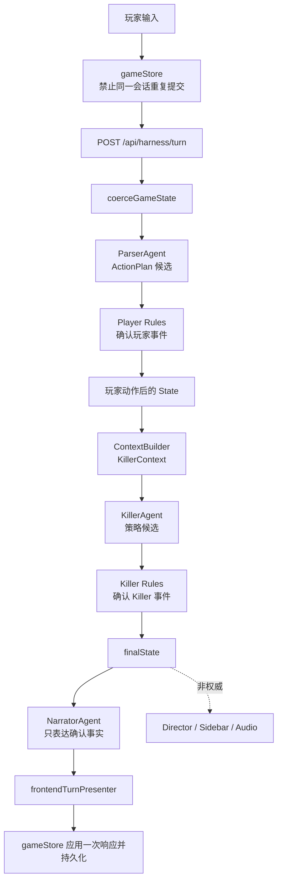

# Murder Loop AI：Hackathon MVP 架构

> - 状态：当前实施目标
> - 目标：优先完成一款可玩、可信、可演示的互动悬疑游戏
> - 当前代码入口：参见 `docs/architecture-current.md`
> - 长期演进参考：参见 `docs/ai-first-world-model-arbiter-handoff.md`

## 1. 这份文档解决什么问题

本项目当前不需要先建设一套生产级多 Agent 平台。MVP 只需要保证：玩家可以自由输入，游戏能正确理解主要动作，世界状态不会被 AI 文案随意改写，时间循环能够稳定重置，故事可以连续游玩。

因此，MVP 直接复用现有 harness 主链，不新增 Main World Model、全量 Specialist、Derived Signal Broker、Provenance Ledger 或独立 High-Risk Gate。

MVP 的核心链路只有：

```text
玩家输入
→ Parser 生成 ActionPlan
→ 本地规则确认玩家事件并更新 State
→ Killer 基于受限上下文提出行动
→ 本地规则确认 Killer 事件并更新 State
→ Narrator 根据已确认结果生成文本
→ 返回 finalState 与玩家可见内容
```

这份文档是当前开发和验收的优先依据。长期目标文档中的复杂组件只有在 MVP 已经可玩、且真实问题证明有必要时才引入。

## 2. MVP 范围

### 必须完成

- 玩家通过自然语言提交一个或多个动作；
- Parser 保留动作顺序、明确否定、限定范围和关键指代；
- `game-core` 决定动作是否成功以及产生哪些状态变化；
- Killer 只能根据 `KillerContext` 中可知、可观察的信息行动；
- NPC 只对实际送达的消息作出反应；
- Narrator 只能表达规则已经确认的结果；
- Clue 和 Recommendation 只能来自规则事件、Observation 或正式 State；
- 死亡、Ending 和循环重置由本地规则决定；
- 玩家可以完成一轮调查、死亡回溯并在下一循环继续游戏；
- AI 不可用时，系统仍能给出保守且不篡改事实的结果。

### 当前不做

- 新建 Fast Semantic Compiler；
- 新建 Main World Model 与全量并行 Specialist；
- 完整 POAG、HTN 或行为树规划系统；
- 独立 Derived Signal Broker；
- 统一 Event Envelope 或 Provenance Ledger；
- 完整事件溯源、分布式事务或服务拆分；
- TLA+、gRPC、CloudEvents、Avro、混沌工程；
- 为每类 Agent 建立独立服务或独立数据库；
- 为了修复局部错误而重新生成整个回合。

如果一个本地函数、现有类型或回归测试能够解决问题，就不新增架构组件。

## 3. 当前代码与 MVP 的关系

当前正式入口保持不变：

```text
apps/web/src/store/gameStore.ts
→ apps/web/src/api/harnessTurnClient.ts
→ POST /api/harness/turn
→ apps/server/src/routes/harnessTurn.ts
→ packages/game-core/src/loop/resolveTurn.ts:resolveTurnHarness()
```

现有模块在 MVP 中的定位如下：

| 当前模块 | MVP 定位 | 是否继续使用 |
|---|---|---|
| `ParserAgent` | 把玩家输入转换成 `ActionPlan` | 保留 |
| `RuleAgent` / player rules | 验证玩家动作并生成正式结果 | 保留，作为事实权威 |
| `KillerAgent` | 基于 `KillerContext` 提出候选策略 | 保留 |
| Killer rules | 验证 Killer 是否有知识、能力和路径执行策略 | 保留并加强 |
| `NarratorAgent` | 表达已经确认的结果 | 保留，但没有状态写权限 |
| `NpcAgent` | 只在消息实际送达时生成回复 | 按需调用 |
| `DirectorAgent` | 质量提示和调试 | 可异步或关闭，不阻塞回合 |
| Sidebar / Audio | 非权威展示附加项 | 可并行，失败不影响 State |
| `ContextBuilder` | 为不同角色生成最小权限上下文 | 保留，不优先重构 |
| `HarnessDispatcher` / `AgentRegistry` | 复用现有调度、fallback 和 trace | 保留，不新增第二套编排器 |

这里的“简化”不是把已经能运行的 Agent 全部重写成一次模型调用，而是不再新增另一套 Agent 架构。所有现有 Agent 都必须服从同一个 `resolveTurnHarness()` 正式入口和 `game-core` 事实边界。

## 4. 唯一正式回合链路



回合内允许多个现有 AI 角色，但状态变化必须按顺序经过本地规则。任何 AI 原始文本都不能直接写入 State。

## 5. 三层事实边界

### 5.1 AI Proposal：候选，不是事实

以下对象都属于候选：

- `ActionPlan`；
- `KillerStrategy`；
- `NpcReply`；
- `Narration`；
- Recommended Action 候选。

AI 可以提出“尝试打开门”“Killer 使用备用钥匙”“包裹里可能有纸条”，但候选不会自动成为世界事实。

### 5.2 DomainEvent / RuleResult：回合事实来源

玩家和 Killer 的行动必须经过 `game-core` 规则。规则输出的 `DomainEvent`、`RuleEvent` 和 `RuleResult.state` 决定本回合实际发生了什么。

必须满足：

- 事件引用存在的 Actor、物品和位置；
- 未打开区域不能产生内部 Observation；
- 工具只能绕过自己具有能力的障碍；
- Actor 只能基于自己知道的事实行动；
- 上游事件失败时，下游结果一并失效；
- Death / Ending 必须来自合法攻击、伤害或结局条件；
- 被规则拒绝的结果不能进入 State。

MVP 不新建独立 Arbiter 服务。现有 `applyPlayerActions()`、DomainEvent evaluator、Killer rules 和 Ending rules 共同承担简化 Arbiter + Reducer 的职责。

### 5.3 Render Artifact：只能表达事实

以下内容都是非权威展示：

- Narration；
- NPC 文本；
- Story Log；
- Sidebar；
- Recommendation；
- Audio Cue；
- Director Critique。

它们只能读取已经确认的规则结果，不能反向修改 State、Knowledge、Clue、Death 或 Ending。

Narrator 失败或输出与规则结果冲突时，优先使用 `RuleResult.title/text` 组成简短事实文案，而不是修改世界去迎合 Narrator。

## 6. 最小 ActionPlan 契约

MVP 保留现有 `ActionPlan.actions[]`，不升级成完整 POAG。

数组顺序表示玩家明确的默认执行顺序；只有真实依赖关系需要增加 `dependsOnActionIds`。为了处理“只”“不要”“如果”等表达，可以在现有契约上增加少量结构化约束：

```text
ActionPlan:
  id
  raw
  summary
  actions[]
  constraints[]
  confidence
  warnings[]

ActionConstraint:
  type: must_not | scope_only | conditional
  actionId?
  target?
  value
  originalSpan
```

例子：

> 我先不开门，只拍包裹外面的标签，把照片发给林越。

最小结构应表达：

```text
actions:
  photograph(package, scope=exterior.label)
  send_message(linyue, attachment=photo)

constraints:
  must_not(open_door)
  scope_only(photograph, exterior.label)
```

MVP 不要求解析所有中文表达。影响 State 的关键歧义无法安全缩小时，应请求玩家澄清；不能用关键词猜一个高风险动作。

## 7. 关键世界规则

只实现能保护核心玩法的通用规则，不为每句剧情写 if/else。

### 门与进入

- 普通钥匙可以绕过门锁，不能绕过门链或行李箱路障；
- 所有有效障碍解除前，不能确认 `actor_entered`；
- Killer 可以尝试进入，规则可以把结果确认成“被门链阻止”；
- 玩家明确不开门时，Parser 不得生成玩家开门动作。

### 包裹与 Observation

- 只观察外包装时，只能产生标签、外观、气味和外部破损信息；
- 包裹未打开时，不得产生旧书、药盒、内部纸条等内部事实；
- Clue 必须来自规则事件或明确 Observation，不能从 Narrator 正文提取。

### 通信与 Knowledge

- 消息成功送达后，接收者 Knowledge 才能更新；
- 私发照片只对发送者和接收者可见；
- Killer 不能因为玩家在原文里提到某件事就自动知道它；
- NPC 未收到消息时，不生成基于该消息的正式回复或状态变化。

### Death、Ending 与时间循环

- Death 必须有合法攻击或伤害事件；
- Ending 必须满足本地结局条件；
- 证据不足时宁可不产生不可逆结果；
- 不为了强行产生 Death / Ending 再调用一轮 AI。

## 8. State、并发与循环

当前 MVP 是单玩家、客户端携带 `coreState` 的回合系统：

- `game-core` 是状态转换权威；
- `gameStore` 是 Web 侧当前状态和持久化入口；
- Server 根据请求中的 `coreState` 计算下一状态并返回；
- Web 只应用一次完整成功响应；请求失败时不应用部分结果。

MVP 不建设服务端分布式 Atomic Commit。并发安全使用现有简单策略：

- 同一会话只允许一个回合请求在途；
- `inputBusy` 与请求队列阻止双击和乱序提交；
- reset / rewind 时不得同时提交新动作；
- 如果允许在请求期间 reset，必须用本地 request token 丢弃旧响应。

当前 `GameState.run` 直接作为循环标识，不额外增加 `loopId`。

`rewindAfterDeath()` 至少需要：

- 恢复门、位置、物品、威胁和角色临时状态；
- 重置 NPC / Killer 的本轮 Knowledge；
- 保留明确标记为 `cross_run` 的玩家记忆；
- 按 `isPersistent` 策略处理玩家已经发现的线索；
- 不保留上一循环尚未完成的 UI 或 AI 结果。

## 9. 失败与降级策略

MVP 不做自动修复循环。每个失败点最多执行一次保守降级：

| 失败位置 | MVP 降级 |
|---|---|
| Parser 无法解析 | 请求澄清，或生成安全 `wait`；不使用高风险关键词猜测 |
| 玩家规则拒绝动作 | 保留合法动作，返回受阻/失败的事实结果 |
| Killer Agent 失败 | Killer 等待或保持现有状态 |
| Killer 策略非法 | 本地规则拒绝，不改成另一个复杂剧情 |
| NPC Agent 失败 | 本回合沉默，不伪造已送达回复 |
| Narrator 失败或越权 | 使用 RuleResult 的简短事实文案 |
| Director / Sidebar / Audio 失败 | 忽略，不影响回合 State |
| 整体请求失败 | 前端保留请求前 `coreState`，允许玩家重试 |

禁止为了修复一个 Agent 的错误重新运行完整回合。

## 10. 当前实现需要收口的缝隙

下面是从当前代码迁移到 MVP 边界时应优先处理的问题，不代表要重写整个 harness：

1. Narrator 正文不能再反向添加动态 Clue；动态线索必须引用规则事件或 Observation；
2. Narration outcome hints 不能反向改变正式 State；Narrator 与规则冲突时应降级文本；
3. StoryNode 不能在玩家动作结算前短路整个回合；固定剧情只能在合法动作之后追加内容或推进阶段；
4. KillerStrategy 除 Schema 校验外，还必须经过 Knowledge、能力、路径和门障碍规则；
5. Recommendation 只能基于最终 State 和玩家可见事件，不能依据 Narrator 幻觉；
6. reset / rewind 与在途请求必须互斥，避免旧响应覆盖新循环。

这些问题优先通过现有函数边界和失败测试修复，不新增 Broker、Ledger 或第二套状态系统。

## 11. MVP 关键回归场景

在继续增加玩法前，至少固定以下回归场景：

1. “不开门，只拍外包装并私发林越”不会打开门或泄露包裹内部；
2. “反锁、扣门链、行李箱堵门”能够阻止备用钥匙直接进入；
3. 玩家假设“如果开门会怎样”不会真的执行开门；
4. 消息发送失败时，NPC Knowledge 不更新且不生成正式回复；
5. 私发照片不会自动更新 Killer Knowledge；
6. 被规则拒绝的事件不会残留在 State、Clue、Recommendation 或文本；
7. Narrator 提到不存在的纸条时，不会创建动态 Clue；
8. Killer 没有合法路径接触玩家时，不能直接产生 Death；
9. StoryNode 不会吞掉同回合的合法拍照、录音、锁门等动作；
10. 死亡回溯恢复世界状态，同时保留配置允许的跨循环记忆；
11. 连续快速提交只结算一个回合；
12. reset / rewind 后，旧请求响应不能覆盖新状态。

测试顺序遵循：先写能复现问题的失败测试，再修改实现，再运行完整回归。

## 12. MVP 完成标准

达到以下条件即可认为架构足以支撑 Hackathon 演示：

- 正式玩法只通过 `/api/harness/turn`；
- 玩家能够连续完成调查、通信、防御、等待、死亡和回溯；
- 上述关键回归场景全部通过；
- Narrator、Sidebar、Recommendation 不具有事实写权限；
- Killer 信息边界测试通过；
- AI 某个非关键角色失败时，回合仍能安全收束；
- 没有无限重试或整回合修复循环；
- 常见回合在模型正常响应时具有可接受的交互等待，不设未经实测的生产级 SLA；
- 类型检查、game-core 测试和 server 测试通过。

最低验证命令：

```text
npm run test -w @murder-loop-ai/game-core
npm run test -w @murder-loop-ai/server
npm run typecheck
```

## 13. 推荐实施顺序

每一步只完成一个逻辑块，并在通过测试后提交：

1. 为第 11 节场景补失败测试，记录当前真实行为；
2. 收紧 ActionPlan 的否定、范围、假设和依赖表达；
3. 切断 Narrator → State / Clue 的反向写入；
4. 修正 StoryNode 对玩家动作的前置短路；
5. 加强 Killer Knowledge、能力、路径和门障碍验证；
6. 让 Recommendation 只读取最终玩家可见事实；
7. 验证 rewind/reset 与在途请求互斥；
8. 运行完整测试、类型检查和真实剧本回归；
9. 玩法稳定后，再根据实际指标决定是否需要长期目标架构中的组件。

## 14. 复杂度升级门槛

只有出现真实、重复、无法在现有边界内解决的问题时，才升级架构：

| 真实问题 | 再考虑的能力 |
|---|---|
| Parser 长期无法稳定处理复合输入 | 独立 Fast Semantic Compiler 或更强 Action Graph |
| Killer/NPC 仍频繁知识串线 | 更严格的 Fact Projection 或窄 Specialist |
| 条件信号在多个模块中产生矛盾 | Derived Signal Broker |
| 无法回答事件为什么被接受 | Provenance Ledger |
| 多 Agent 实测尾延迟失控 | deadline controller 或减少调用 |
| 多用户并发导致状态冲突 | 服务端版本控制和原子提交 |
| 高风险误判在规则测试后仍反复出现 | 独立 High-Risk Gate |

在这些问题真实出现之前，MVP 继续使用当前 harness 和本地规则，不提前建设未来系统。
