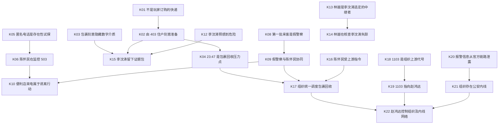

# 《23:47》递归线索推理与结局评分设计 v2

> 状态：新设计基线，待实现
>
> 依据：`plot-design.md` v3.1、当前 `clueBook`、当前知识激活与多维评分实现
>
> 目标：把“原始线索 → 中间结论 → 深层结论 → 评分维度 → 主动结案”整理成可追溯、可扩展、可测试的完整关系。

## 一、先确定设计边界

### 1.1 四类信息必须分开

| 类型 | 含义 | 示例 | 是否参与真相推理 |
|---|---|---|---|
| 原始线索 `Clue` | 玩家实际看见、听见、读取或从可信来源获得的原子事实 | “23:01 有一通 4 秒未接来电” | 是 |
| 推理结论 `Knowledge` | 玩家把线索和已有结论组合后形成的命题 | “匿名来电是在确认 503 是否有人” | 是，贡献 `truthLayer` |
| 证据保全状态 `Evidence State` | 证据是否被拍摄、导出、送达和确认接收 | “林越已确认收到 U 盘账本副本” | 不贡献真相分，影响 `evidenceStrength`、`externalReach` |
| 生存与世界状态 `World State` | 电量、防御物、危险值、破门进度、角色生死等实时状态 | “手机电量低于 15%” | 不参与推理，影响死亡速度或 `survivors` |

不能再把这四类信息都塞进 `clueBook`。否则“手机快没电”“找到武器”会和“1103 指向赵鸿远”一起出现在结案卡里，玩家也无法理解分数从哪里来。

### 1.2 递归推理规则

新的推理关系必须是有向无环图（DAG）：

```text
原始线索
  → 一级结论
  → 一级结论 + 新线索
  → 二级结论
  → 多个已确认结论 + 身份桥接线索
  → 最终结论
```

每张结论卡必须保存完整的支持树，而不只是最后一层输入。例如：

```text
赵鸿远控制组织及公安内线网络
  ├─ 组织统一调度包裹回收
  │   ├─ 23:47 是回收压力点
  │   ├─ 假警察与陈怀民协同
  │   └─ 陈怀民受上游指令，是现场执行者
  ├─ 1103 指向赵鸿远
  └─ 组织存在公安内线
```

这样玩家点击深层结论时，可以一路展开到最底层原始线索；系统也能解释“这个结论是怎样得到的”。

### 1.3 不再使用“包裹寄错到 503”

v3.1 前史已经明确：李汶涛故意把证据包留给 503，陈怀民扣下后，包裹才落到新租客沈知夏手里。因此：

- 可以推出“这不是沈知夏的个人快递”；
- 可以推出“包裹由 403 的李汶涛准备，并刻意留在 503”；
- 不能再推出“快递员把包裹误投到 503”。

现有 `wrong_package` 的命名和知识 `package_not_for_503` 都与当前剧情真相冲突，应删除或迁移。

## 二、目标链路总览



这张图只显示结论之间的依赖；每条结论对应的原始线索和精确组合规则见第四节。

## 三、原始线索与剧情信号清单

### 3.1 包裹、403 与 U 盘

| 原始线索 ID | 玩家实际获得的事实 | 来源状态 | 主要用途 |
|---|---|---|---|
| `package_label_fragment` | 面单被撕去一半，只剩“青荷公寓 5-0”，收件人不完整 | 剧情已有，待固定模板 | K01 |
| `no_matching_order` | 沈知夏的订单和快递记录中没有对应包裹 | 建议新增桥接事实 | K01 |
| `package_hand_wrapped` | 纸箱被手工胶带缠了三层，不符合普通快递封装方式 | 剧情已有，待固定模板 | K02 |
| `vacuum_packaging` | 包裹内有多件真空包装物 | 剧情已有，待固定模板 | K03、红鲱鱼 H01 |
| `serial_cash` | 包裹内是连号新钞，银行封条日期为 07-15 | 剧情已有，待固定模板 | 红鲱鱼 H01 |
| `usb_locked_0724` | 包裹内有磨损 U 盘，标签为“0724”，内容加密 | 剧情已有，待固定模板 | K03、内容解锁 |
| `room_403_receipt` | 一周前的收据购买了胶带、记号笔、一次性手机，背面写 403 | 现有模板，需统一地名 | K02 |
| `room_403_collection_notice` | 403 的近期催缴单写着李汶涛姓名 | 剧情已有，待固定模板 | K11、红鲱鱼 H02 |
| `li_last_warning_note` | 403 纸条写着“如果他来，就说我搬走了” | 剧情已有，待固定模板 | K12 |
| `room_403_cigarette_pack` | 403 留有半包特定品牌香烟 | 剧情已有，待固定模板 | K11、红鲱鱼 H02 |
| `awning_cigarette_butt` | 503 窗外雨棚有同品牌、尚未被雨冲走的烟蒂 | 剧情已有，待固定模板 | K11 |
| `notebook_chen_schedule` | 403 地砖下的笔记本记录了陈怀民巡视和交接规律 | 剧情已有，待固定模板 | K11 |
| `notebook_zhao_visit_log` | 笔记本记录“赵先生”、黑色凯美瑞和陈怀民接头时间 | 剧情已有，待固定模板 | K19 |
| `usb_password_0724` | 403 笔记本给出 U 盘密码或明确的解密方法 | 剧情已有，待固定模板 | 解锁 U 盘，不直接加真相分 |
| `usb_ledger_transactions` | 解密后看到洗钱转账、转运点和参与者记录 | 剧情已有，待固定模板 | K15 |
| `usb_member_code_1103` | 账本把 1103 标记为组织中的上游代号 | 剧情已有，待固定模板 | K18 |
| `usb_police_badge_entry` | 账本成员或付款记录中出现可核对的警号 | 剧情已有，待固定模板 | K21 |
| `voice_goods_not_returned_2347` | 23:47 前结算到楼下原话：“货没回去” | 由 `handoff_failed_2347` 拆分 | K04 |
| `li_pinprick_note_zhao_police_inside` | 笔记本空白页针孔字迹为“赵、公安、内” | 剧情已有，待固定模板 | K21 的佐证，不可单独定案 |

### 3.2 陈怀民与 503

| 原始线索 ID | 玩家实际获得的事实 | 来源状态 | 主要用途 |
|---|---|---|---|
| `missed_call_4s` | 23:01 出现一通 4 秒未接来电 | 剧情已有，待固定模板 | K05 |
| `voip_callback_dead` | 回拨后为空号或网络中转号 | 剧情已有，待固定模板 | K05 |
| `chen_knock_2312` | 陈怀民在匿名来电后不久于 23:12 敲门 | 剧情已有，待固定模板 | K06 |
| `chen_package_claim` | 陈怀民明确询问或认领“上一个租客留下的包裹” | 由 `doorstep_package_claim` 缩窄 | K04、K06 |
| `door_scratch_new` | 锁芯有当天形成的非正常插入划痕 | 由 `door_scratch` 缩窄 | K07 |
| `chen_keys_503` | 陈怀民持有可实际打开 503 的备用钥匙 | 现有模板 | K07 |
| `chen_phone_upstream_order` | 陈怀民手机中有上游下达的回收、灭证或调查命令 | 由 `chen_phone_found` 拆分 | K16 |
| `chen_fear_call` | 陈怀民通话中明显害怕上游知道包裹失控，并接受指令 | 剧情已有，待固定模板 | K16 |
| `chen_phone_zhao_voice` | 陈怀民手机中有署名赵鸿远的语音命令，内容与回收行动一致 | 剧情已有，待固定模板 | K19 |
| `chen_card_1103` | 陈怀民名片背面写着 1103 | 剧情已有，待固定模板 | K18 |
| `chen_knew_fake_police_arrival` | 陈怀民在第一批自称警察的人到达前就知道他们会来 | 剧情已有，待固定模板 | K09 |

### 3.3 林越与李汶涛

| 原始线索 ID | 玩家实际获得的事实 | 来源状态 | 主要用途 |
|---|---|---|---|
| `linyue_retracted_message` | 林越发出“那个包裹你别……”后撤回 | 现有模板 | 只能形成怀疑 H03，不直接确认真相 |
| `li_warning_to_linyue` | 林越复述李汶涛的话：“一周后没联系，包裹在 503” | 剧情已有，待固定模板 | K12、K13 |
| `li_last_call_to_linyue` | 李汶涛最后一通拨出电话打给林越，通话 0 秒 | 剧情已有，待固定模板 | K13 |
| `li_timed_report_record` | 23:23 的预置报警可追溯到李汶涛提前设置 | 剧情已有，待固定模板 | K12 |
| `linyue_investigation_notes` | 林越保存了 403 空置、烟盒、门锁划痕和陈怀民异常的记录 | 剧情已有，待固定模板 | K14 |
| `linyue_saw_zhao` | 林越曾听见陈怀民称车内来客为“赵哥” | 剧情已有，待固定模板 | K19 |
| `linyue_master_key_access` | 维修工林越拥有公共区域或部分房门的工作钥匙 | 剧情已有，待固定模板 | 红鲱鱼 H03 |
| `linyue_corridor_lingering` | 林越曾在五楼走廊观察 403、503 和楼下动静 | 剧情已有，待固定模板 | 红鲱鱼 H03 |
| `li_missing_confirmation` | 林越、租赁记录或可信联系人确认李汶涛已失联一周 | 剧情已有，待固定模板 | 排除 H02；仍不能单独证明死亡 |

### 3.4 真假警察、报警泄露与诱离

| 原始线索 ID | 玩家实际获得的事实 | 来源状态 | 主要用途 |
|---|---|---|---|
| `false_police_overknows` | 第一批来客准确说出玩家报警时没有公开的“纸箱”等细节 | 现有模板 | K08 |
| `fake_police_no_badge_number` | 第一批来客不报警号、所属单位或接警编号 | 剧情已有，待固定模板 | K08 |
| `police_question_mismatch` | 第一批来客先套个人情况，真警察先报身份并核实案件 | 剧情已有，待固定模板 | K08、排除 H04 |
| `no_matching_dispatch_for_first_visitors` | 官方渠道明确答复：第一批来客对应的时间、单位和人员没有匹配出警记录 | 替代 `police_verified` | K08 |
| `real_police_dispatch_identity` | 真警察提供了能由 110 核对的警号、单位和接警编号 | 剧情已有，待固定模板 | K20、排除 H04 |
| `real_police_delayed` | 真警察已经接警，却被异常调度或陈怀民拖延 | 剧情已有，待固定模板 | K21 的佐证、红鲱鱼 H04 |
| `zhao_knew_unpublic_report` | 赵鸿远在陈怀民汇报前，已知道只有报警系统掌握的内容 | 剧情已有，待固定模板 | K20 |
| `fake_store_call` | 来电称玩家在便利店遗失物品，但玩家当晚没有去过 | 现有模板 | K10 |
| `real_police_questioned_chen` | 真警察在楼下询问陈怀民而未立即上楼 | 剧情已有，待固定模板 | 红鲱鱼 H04，不直接加真相分 |
| `real_police_challenged_first_group` | 真警察要求第一批来客说明所属单位，对方无法回答并撤离 | 剧情已有，待固定模板 | 排除红鲱鱼 H04 |

### 3.5 证据保全与接收信号

下列 ID 不是案件推理线索，而是对玩家操作结果的确认。它们单独进入证据评分，不出现在 K01～K22 的真相输入中。

| 状态 ID | 必须确认的客观结果 | 主要用途 |
|---|---|---|
| `package_exterior_photo` | 照片清楚记录包裹未开启时的面单、封装和现场位置 | `evidence_origin_recorded` |
| `package_contents_photo` | 照片清楚记录包裹开启后的现金、真空包装和 U 盘 | `evidence_origin_recorded` |
| `usb_ledger_export` | 已解密账本被完整导出，并保留文件完整性信息 | `digital_evidence_readable` |
| `linyue_evidence_ack` | 林越明确回传他收到的证据包编号或内容摘要 | `evidence_external_backup`、external 40 |
| `official_case_receipt_id` | 可信官方渠道返回可核对的案件号或证据接收回执 | `evidence_independently_received`、external 70 |
| `independent_backup_ack` | 一个非林越、非同一官方系统的独立节点确认持有副本 | external 100 的冗余条件 |

“玩家点击了发送”只能生成发送事件，不能直接生成接收状态；只有收到对应确认后，证据链才算跨出本地设备。

## 四、完整“原始线索 → 递归结论 → 评分维度”关系表

### 4.1 L1：确认包裹异常、监控与现场入侵

| 编号 / 结论 ID | 显示结论 | 精确输入 | 组合规则 | 为什么能够推出 | 评分 |
|---|---|---|---|---|---:|
| K01 `package_not_players_order` | 包裹不是沈知夏订购的快递 | `package_label_fragment` + `no_matching_order` | 全部满足 | 面单无法确认玩家身份，且玩家没有对应订单，只能确认“不是她订购的快递”，不能说“寄错 503” | truth +3 |
| K02 `package_prepared_by_room_403` | 包裹由 403 住户刻意准备 | K01 + `package_hand_wrapped` + `room_403_receipt` | 全部满足 | 收据购买物与包裹封装方式吻合，背面的 403 提供来源地址，K01 排除玩家本人准备 | truth +4 |
| K03 `package_hides_digital_material` | 包裹在刻意隐藏数字资料 | `vacuum_packaging` + `usb_locked_0724` | 全部满足 | 被真空封装、反复使用且加密的 U 盘说明存储介质被有意识隐藏；此时尚不能断言内容是什么 | truth +3 |
| K04 `recovery_deadline_2347` | 23:47 是包裹回收的压力点 | K02 + `chen_package_claim` + `voice_goods_not_returned_2347` | 全部满足 | 陈怀民此前明确追索该包裹，23:47 又有人抱怨“货没回去”，两段行为把“货”与证据包连接起来 | truth +4 |
| K05 `anonymous_call_is_presence_probe` | 匿名来电是在确认 503 是否有人 | `missed_call_4s` + `voip_callback_dead` | 全部满足 | 极短来电加不可回拨的网络号码符合一次性存在性试探，而不是普通误拨 | truth +2 |
| K06 `chen_monitors_room_503` | 陈怀民在监控 503 和包裹状态 | K05 + `chen_knock_2312` + `chen_package_claim` | 全部满足 | 匿名试探后陈怀民迅速出现，并准确追问包裹，时间顺序和信息内容把匿名试探与陈怀民关联 | truth +5 |
| K07 `chen_attempted_entry_503` | 陈怀民具备并尝试过进入 503 | K06 + `door_scratch_new` + `chen_keys_503` | 全部满足 | 新鲜划痕证明近期有人尝试进入，备用钥匙证明陈怀民具备手段，K06 再把他与当晚对 503 的监控行动连接起来 | truth +4 |

L1 累计上限为 25。到这里，玩家知道包裹异常且陈怀民直接参与，但还不能推出幕后组织。

### 4.2 L2：识别假警察、还原李汶涛与林越

| 编号 / 结论 ID | 显示结论 | 精确输入 | 组合规则 | 为什么能够推出 | 评分 |
|---|---|---|---|---|---:|
| K08 `first_visitors_are_fake_police` | 第一批自称警察的来客是假的 | `false_police_overknows` +〔`no_matching_dispatch_for_first_visitors`，或（`fake_police_no_badge_number` + `police_question_mismatch`）〕 | 必须有“知道不该知道的细节”，再加官方不匹配或两项身份协议异常 | 说漏细节只能证明可疑；官方记录或成组的身份流程异常才把怀疑提升为可确认结论 | truth +5 |
| K09 `fake_police_coordinated_with_chen` | 假警察与陈怀民协同行动 | K08 + `chen_knew_fake_police_arrival` | 全部满足 | 已确认来客为假警察，而陈怀民提前掌握其到达时间，排除普通物业偶遇 | truth +4 |
| K10 `store_call_is_lure_operation` | 便利店来电是诱使玩家离开 503 的行动 | `fake_store_call` + K06 + K09 | 全部满足 | 来电内容可由玩家亲自否定；陈怀民的监控和假警察协同又给出了诱离的受益者与执行网络 | truth +3 |
| K11 `li_monitored_chen_from_403` | 李汶涛曾从 403 观察并记录陈怀民 | `room_403_collection_notice` + `room_403_cigarette_pack` + `awning_cigarette_butt` + `notebook_chen_schedule` | 全部满足 | 催缴单确定 403 使用者，香烟把 403 与观察位置连接，笔记本说明观察对象是陈怀民的行动规律 | truth +4 |
| K12 `li_expected_imminent_danger` | 李汶涛预感自己即将遭遇危险 | `li_last_warning_note`、`li_warning_to_linyue`、`li_timed_report_record` | 任意 2 条，且必须包含纸条或定时报警 | 留下躲避口令、安排一周后联系人和预置报警都是面向未来危险的独立准备，组合后才能排除偶然 | truth +5 |
| K13 `linyue_is_li_trusted_relay` | 林越是李汶涛选定的信息中继者 | `li_warning_to_linyue` + `li_last_call_to_linyue` | 全部满足 | 李汶涛既提前把包裹位置告诉林越，又在最后时刻尝试联系他，说明林越是预先选择的接力人 | truth +3 |
| K14 `linyue_is_investigating_li` | 林越在自行核查李汶涛失踪 | K13 + `linyue_investigation_notes` + K11 | 全部满足 | K13 给出调查动机，林越的记录给出实际行为，K11 证明其记录与李汶涛留下的观察链相互吻合 | truth +5 |
| K15 `li_created_evidence_drop` | 李汶涛留下的是证据包，不是普通交易货物 | K02 + K03 + K12 + `usb_ledger_transactions` | 全部满足 | 403 来源、刻意隐藏、预先防险和洗钱账本形成完整目的链，足以解释李汶涛为何把包裹留在 503 | truth +6 |

L2 累计上限为 60。K15 激活后，红鲱鱼“包裹只是毒品交易货物”被否定。

### 4.3 L3：确认执行层、组织调度与 1103 代号

| 编号 / 结论 ID | 显示结论 | 精确输入 | 组合规则 | 为什么能够推出 | 评分 |
|---|---|---|---|---|---:|
| K16 `chen_is_field_executor` | 陈怀民受上游指令，是现场执行者 | `chen_phone_upstream_order` + `chen_fear_call` | 全部满足 | 手机命令证明有人向他下达任务，通话中的畏惧和请示证明他受制于上游；这里不做“他绝无其他决策权”的过度否定 | truth +6 |
| K17 `organization_controls_recovery` | 包裹回收由组织统一调度 | K04 + K09 + K16 | 全部满足 | 固定压力点、假警察资源和受命执行者分别证明时间、资源与层级，三者合并才构成组织化行动 | truth +6 |
| K18 `code_1103_is_org_upstream` | 1103 是组织上游代号 | `chen_card_1103` + `usb_member_code_1103` | 全部满足 | 陈怀民随身记录的数字与账本中的上游代号一致，排除它只是房号、日期或随机数字 | truth +5 |

L3 累计上限为 77。此时玩家可以确认存在幕后组织，但仍不能直接把 1103 归到赵鸿远本人。

### 4.4 L4：完成赵鸿远身份桥和公安内线证据链

| 编号 / 结论 ID | 显示结论 | 精确输入 | 组合规则 | 为什么能够推出 | 评分 |
|---|---|---|---|---|---:|
| K19 `code_1103_is_zhao_hongyuan` | 1103 指向赵鸿远 | K18 + `chen_phone_zhao_voice` +〔`notebook_zhao_visit_log` 或 `linyue_saw_zhao`〕 | K18、手机身份桥必需，再要一条独立现场佐证 | K18 先证明 1103 是陈怀民的上游；手机命令把上游命名为赵鸿远；笔记本或证人再独立确认“赵”与陈怀民的上下级关系 | truth +8 |
| K20 `police_report_was_leaked` | 报警信息从官方链路泄露给赵鸿远 | `zhao_knew_unpublic_report` + `real_police_dispatch_identity` | 全部满足 | 可核对的接警编号证明信息已经进入官方系统；赵鸿远在陈怀民汇报前掌握未公开内容，泄露点只能位于玩家与官方之间的受限链路 | truth +4 |
| K21 `organization_has_police_insider` | 组织存在公安内线 | K20 + `usb_police_badge_entry` +〔`real_police_delayed` 或 `li_pinprick_note_zhao_police_inside`〕 | 泄露结论和账本警号必需，再要一条行动或死者记录佐证 | K20 证明发生过内部泄露，账本警号证明组织与具体警务身份存在利益联系，第三条证据说明这种联系实际影响了案件 | truth +6 |
| K22 `zhao_controls_org_and_insider_network` | 赵鸿远控制组织及公安内线网络 | K17 + K19 + K21 | 三条深层结论全部满足 | K17 证明存在统一调度，K19 完成上游身份映射，K21 证明该组织能调用公安内线；三者合并才足以描述完整控制网络 | truth +5 |

L4 累计上限为 100。K22 是最高层真相，不允许由任何单条手机记录、单条 1103 数字或 LLM 叙述直接激活。

## 五、待验证假设与红鲱鱼

待验证假设可以显示在推理板上，但 `truthLayerContribution = 0`，也不能满足“至少三条正向结论才能结案”的门槛。

| 假设 ID | 形成它的线索 | 为什么暂时看起来合理 | 如何排除或修正 |
|---|---|---|---|
| H01 `package_is_drug_shipment` | `vacuum_packaging` + `serial_cash` | 真空包装和连号现金像违禁品交易 | K15 与 `usb_ledger_transactions` 证明核心目的是保存洗钱证据 |
| H02 `room_403_occupant_is_active` | `room_403_cigarette_pack` + `room_403_collection_notice` | 烟盒和近期单据看似说明仍有人居住 | `li_missing_confirmation` + K12 说明这些是失踪前遗留物；仍不能直接推出死亡 |
| H03 `linyue_may_be_accomplice` | `linyue_retracted_message` + `linyue_master_key_access` + `linyue_corridor_lingering` | 他有进入条件、行为躲闪且知道包裹 | K13 + K14 使其主要行为得到“受托中继并自行调查”的更强解释；不额外生成“绝对无共谋”的得分命题 |
| H04 `real_police_may_be_complicit` | `real_police_delayed` + `real_police_questioned_chen` | 真警察迟到且先与陈怀民交谈 | `real_police_dispatch_identity` + `real_police_challenged_first_group` 证明他们是正式出警且主动盘查假警察，迟延本身不能证明同谋 |

## 六、证据链与其他评分维度

### 6.1 `truthLayer`

`truthLayer` 只累计 K01～K22 的正向贡献，同一结论只计一次：

| 真相阶段 | 结论范围 | 累计上限 | 玩家实际掌握 |
|---|---|---:|---|
| L1 | K01～K07 | 25 | 包裹异常、陈怀民监控和入侵能力 |
| L2 | K08～K15 | 60 | 假警察、林越与李汶涛证据包 |
| L3 | K16～K18 | 77 | 陈怀民是执行者、组织调度、1103 是上游代号 |
| L4 | K19～K22 | 100 | 赵鸿远身份、报警泄露、公安内线与主谋 |

原始线索数量、照片数量、武器、电量、角色尸体和红鲱鱼都不直接增加真相分。

### 6.2 `evidenceStrength`

证据强度按五个互不重复的环节评分，每环 20 分：

| 证据结论 | 精确条件 | 得分 | 说明 |
|---|---|---:|---|
| `evidence_origin_recorded` | `package_exterior_photo` + `package_contents_photo`，且保留同一现场与时间来源 | +20 | 证明证据从哪里来 |
| `digital_evidence_readable` | `usb_password_0724` + `usb_ledger_export` | +20 | 证明数字内容可读取且已导出，不把“拿到 U 盘”误当作“掌握内容” |
| `evidence_attributed` | K19 + K21 | +20 | 证据能够指向具体主谋和内线结构 |
| `evidence_external_backup` | 任一关键证据包已发送，且存在 `linyue_evidence_ack` | +20 | 证明副本离开现场，不以“点击发送”代替“对方收到” |
| `evidence_independently_received` | `official_case_receipt_id`，或两个互不依赖的 `independent_backup_ack` | +20 | 证明可信节点已经登记或多点保全 |

这里不再存在“核实出警后 evidence +20”这种跨语义捷径。

### 6.3 `externalReach`

| 外传状态 | 分数 | 必须记录的事实 |
|---|---:|---|
| 仅玩家本地持有 | 0 | 没有任何外部接收确认 |
| 单一可信私人节点 | 40 | 林越等联系人返回具体证据包的接收确认 |
| 可信官方节点 | 70 | 获得正式案件编号或证据接收回执 |
| 多节点冗余或公开 | 100 | 官方节点之外，至少还有一个独立节点确认持有 |

如果 K21 已确认公安内线，单一官方节点仍可算“已经送达”，但不能满足最高结局的冗余要求。

### 6.4 `survivors` 与 `cycleCost`

这两个维度只读取世界状态：

| 维度 | 建议规则 |
|---|---|
| `survivors` | 林越死亡为 0；林越存活但玩家受伤为 60；林越安全且玩家无伤为 100 |
| `cycleCost` | ≤5 轮为 0；6～10 轮为 -20；11～15 轮为 -40；16～20 轮为 -60；>20 轮为 -100 |

### 6.5 结局评分与主动触发

继续使用当前五维公式，但最终分数限制在 0～100：

```text
总分 = truthLayer × 0.35
     + evidenceStrength × 0.30
     + externalReach × 0.25
     + survivors × 0.15
     + cycleCost × 0.05
```

当前正向权重之和为 1.05，所以必须显式截断最终分数，或者在实现前重新归一化。文档暂按“截断到 100”处理。

| 档位 | 总分 | 触发方式 | 结局后处理 |
|---|---:|---|---|
| S | ≥90 | 玩家主动提交 | 正式结束故事 |
| A | 70～89 | 玩家主动提交 | 接受结果开启新循环，或回到结案前继续调查 |
| B | 50～69 | 玩家主动提交 | 同上 |
| C | 30～49 | 玩家主动提交 | 同上 |
| D | <30 | 玩家主动提交 | 同上 |

主动提交门槛为至少 3 条 `truthLayerContribution > 0` 的已确认结论。玩家选择 3 条结论作为本次结案陈述与 CG 的叙事主轴，但 `scoreEnding()` 使用全部已确认结论和世界状态，避免“三张卡上限”压低最终档位。

## 七、不参与推理的状态与直接效果

以下项目可以继续在侧栏显示，但不能作为推理卡，也不能被玩家选进结案论证。

| 当前或目标状态 | 新归类 | 建议效果 | 是否直接计分 |
|---|---|---|---|
| `usable_defense_item_ready`（由 `weapon_found` 迁移） | 生存资源 | 初始建议：`safety +10`；物品仍在手边时，陈怀民每次行动增加的破门进度乘 0.8 | 否；仅间接影响能否存活 |
| `battery_critical` | 风险状态 | 电量 ≤15% 时 `safety -10`、危险增长速度乘 1.2；电量归零后禁用拍照、录音和通信 | 否；仅间接加快死亡 |
| `door_barricaded` | 防御状态 | 降低破门速度；强度由实际家具和动作决定 | 否 |
| `phone_charging` | 资源恢复状态 | 逐步恢复电量，解除低电量倍率，不一次回满 | 否 |
| `chen_body` | 世界事件 / 搜查入口 | 解锁对钥匙和手机的搜查；尸体本身不提供幕后真相 | 不直接计分 |
| `chen_phone_acquired` | 搜查入口 | 只解锁具体手机内容线索，不等于自动获得所有聊天和身份信息 | 不直接计分 |
| `linyue_has_photo` | 证据保全状态 | 必须改为“发送成功 + 林越确认收到”的托管状态 | 影响 evidence、external，不影响 truth |
| `peephole_blind_spot` | 威胁观察 | 增加即时危险判断，影响 NPC 位置估计；没有人物身份时不推导林越是帮凶 | 否 |

这些数值是首轮平衡参数，不是剧情真相。玩测时可以调整 `+10`、`0.8`、`1.2`，但不能把它们改成真相分。

## 八、旧线索删除与迁移表

| 旧 ID | 处理 | 新去向 | 原因 |
|---|---|---|---|
| `police_verified` | **删除，不做一对一替换** | 假警察判断用 `no_matching_dispatch_for_first_visitors`；官方收证用 `official_case_receipt_id`；内线判断用 K20/K21 | 一个 ID 同时承担身份、证据、外传和内线四种语义，是最严重的万能硬编码 |
| `wrong_package` | 删除旧语义 | `package_label_fragment` + `no_matching_order` → K01 | v3.1 中包裹是故意留在 503，不是误投 |
| `package_contents` | 删除聚合线索 | 拆成真空包装、现金、加密 U 盘、账本、1103、警号等原子事实 | 一个 ID 不能同时证明包裹异常、洗钱、主谋和内线 |
| `package_photo` | 删除宽泛 ID | `package_exterior_photo`、`package_contents_photo` | 当前“外包装照片”和“内容照片”语义冲突 |
| `linyue_has_photo` | 移出线索系统 | `linyue_evidence_ack` 托管状态 | “谁持有副本”是证据流转，不是案件真相 |
| `recording_pressure` | 删除为独立真相线索 | 如保留录音，只作为 `doorstep_recording_file` 证据文件 | 一次停顿不能稳定指向人物、组织或动机，没有独立推理价值 |
| `unknown_number_probe` | 删除宽泛 ID | `missed_call_4s` + `voip_callback_dead` → K05 | 旧 ID 已经把“试探”写进线索名称，混淆观察与结论 |
| `chen_body` | 移出线索系统 | 世界事件，解锁搜查 | 战斗结果不是案件命题 |
| `chen_phone_found` | 移出线索系统并拆分 | 获取事件 + 上游命令、赵鸿远语音等内容线索 | “捡到手机”不等于自动知道手机内全部事实 |
| `weapon_found` | 移出线索系统 | `usable_defense_item_ready` | 它改变生存概率，不解释案件 |
| `battery_critical` | 移出线索系统 | 风险状态 | 它改变资源和死亡速度，不解释案件 |
| `door_scratch` | 缩窄 | `door_scratch_new` | 只有确认划痕新鲜、方向异常后，才具有时间和行为含义 |
| `doorstep_package_claim` | 缩窄 | `chen_package_claim` | 必须记录认领者是陈怀民及其原话，避免匿名门外人被错误归因 |
| `handoff_failed_2347` | 删除解释性命名 | `voice_goods_not_returned_2347` → K04 | “交接失败”应是推理结论，原始线索只能记录听到的原话 |
| `liventao_is_dead`（知识） | 暂停使用 | K12 `li_expected_imminent_danger` | 当前玩家可获得的材料只能证明预感危险和失踪，不能证明死亡 |
| `linyue_is_accomplice`（知识） | 降级 | H03 待验证假设 | 钥匙和走廊徘徊只能形成怀疑，不能成为已确认知识 |

`police_verified` 删除后，不应再创造 `officially_verified`、`police_confirmed` 之类同样宽泛的新 ID。必须记录“核对了什么、得到什么明确结果、对应哪一批来客或哪份证据”。

## 九、如何避免 Reducer 和推理规则硬编码

### 9.1 Reducer 只提交事实，不提交真相

Reducer 的职责应限制为：

```text
候选观察
  → 校验动作是否真的发生
  → 校验玩家是否有观察权限
  → 写入原子线索 / 证据状态 / 世界状态
```

Reducer 不应在收到“玩家回拨 110”后直接写入 `fake_police = true`，也不应在捡到陈怀民手机后直接写入 `zhao_is_1103 = true`。这些都是推理引擎的职责。

### 9.2 结论定义使用数据驱动规则

每条规则至少需要：

```text
id
requiresAllClueIds
requiresAnyClueGroups
requiresAllKnowledgeIds
excludesKnowledgeIds
truthLayerContribution
unlocksDirections
```

推理引擎按拓扑顺序或不动点循环执行：

```text
已确认原始线索
  → 激活所有满足条件的一级结论
  → 把新结论加入集合
  → 再检查依赖结论的规则
  → 直到本轮没有新结论
```

这套通用求值器不需要知道陈怀民、林越或赵鸿远是谁。剧情关系全部放在可审查的规则表中，避免把人物逻辑散落在 Reducer 的 `if/else` 里。

### 9.3 每个结论保存可追溯来源

建议每次激活记录：

- `knowledgeId`；
- 命中的 `ruleVersion`；
- 直接输入的 clue IDs 和 knowledge IDs；
- 展开后的底层 clue IDs；
- 首次激活循环和时间；
- 是否为正向结论或待验证假设；
- 被哪条相反证据推翻。

这样规则调整后可以重算，也能解释为什么旧存档曾经得到某条结论。

### 9.4 LLM 只能提议，不能凭叙事生成深层事实

LLM 可以把玩家动作解析为“检查面单”“回拨 110”“询问警号”等候选动作，也可以生成叙事表现；但固定线索必须由已批准的观察事件投影，K01～K22 必须由确定性规则激活。

## 十、当前设计与实现的主要不足

### 10.1 正式链可达性不足

当前 AI-first 正式投影只稳定支持：

- `wrong_package`
- `package_contents`
- `package_photo`
- `linyue_has_photo`

新图的大多数原始线索尚无正式生成路径。只修改知识定义而不补投影，结论仍然永远无法触发。

### 10.2 当前知识模型不支持“结论 + 结论”

现有 `KnowledgeDefinition` 只读取 `requiredClueIds` 和 clue `anyOf`，无法表达 K17、K19、K21、K22。实现前必须加入 knowledge 依赖，并保证无环和重复激活幂等。

### 10.3 剧情材料存在三处关键冲突

1. `wrong_package` 说“寄错到 503”，v3.1 前史说“故意寄到 503”；
2. 现有收据文案出现“青藤公寓 403”，主地点是“青荷公寓”，必须确认是笔误还是另一个地点；
3. 旧文档有时把林越写成“完全不知情”，v3.1 则写成“主动核查过部分异常”。本文件采用后者，但限制为他不知道 U 盘、假警察和赵鸿远。

这三项必须在内容实现前统一，否则同一组线索会导向互斥真相。

### 10.4 李汶涛死亡缺少玩家可获得的决定性证据

当前前史明确告诉设计者“李汶涛已死”，但玩家侧只有：

- 失联；
- 遗言式纸条；
- 定时报警；
- 最后一通未接电话；
- 上游曾下达“处理”命令。

它们足以激活 K12，却不足以在法律和逻辑上确认死亡。因此 `liventao_is_dead` 暂停计分。如果结局 CG 要明确宣称李汶涛死亡，需要补充至少一种可验证桥梁，例如遗体身份记录、可信官方死亡记录、带可核验细节的执行记录或相互印证的供述。

### 10.5 1103 与赵鸿远仍依赖身份桥

数字同时出现在名片和账本，只能证明 1103 是组织代号。必须再有赵鸿远语音命令及笔记本/证人中的独立“赵”身份记录，才能激活 K19。

### 10.6 公安内线不能由“警察迟到”推出

迟到可能由天气、调度、地址核验或陈怀民拖延造成。K21 必须以 K20 的信息泄露和 U 盘警号为主证，迟到只能做佐证。

### 10.7 23:47 线索与死亡的结算顺序

自动死亡仍只有两个入口：

- 环境危险达到致死阈值；
- 时间到达 23:47。

到达 23:47 时必须按下列顺序执行：

```text
记录并展示“货没回去”的原话
  → 持久化 voice_goods_not_returned_2347
  → 运行推理激活 K04
  → 触发死亡 CG
  → 开启下一轮
```

如果先切换死亡状态，23:47 的关键原始线索会永久不可达。

### 10.8 评分仍需玩测校准

K01～K22 的真相贡献总和恰好为 100，便于解释和测试；但主动结案门槛、资源倍率、五维权重和各档分界仍需用固定金标局面跑回归测试，不能只凭文档数值确认平衡。

## 十一、建议实施顺序

1. 先确认“青荷/青藤”、包裹是否故意留在 503、林越知情边界三项剧情事实；
2. 删除 `police_verified`，并完成旧线索的拆分、迁移和兼容读档映射；
3. 扩展知识定义，使规则能依赖原始线索和已确认结论；
4. 实现支持树、不动点激活、互斥假设和幂等计分；
5. 为第三节所有关键线索补齐 AI-first 的合法观察与正式投影；
6. 把照片接收、官方回执、武器、电量、尸体和手机获取移到各自状态域；
7. 实现线索栏中的组合、结论展开、三结论主动提交与结案快照；
8. 为每条 K 规则至少编写“少一项不激活、满足后激活、重复不计分、深层来源可展开”四类测试；
9. 建立 S、A、B、C、D 五个可复现的金标状态，再校准 `scoreEnding()`。

## 十二、验收标准

- 每个正向结论至少由两项独立信息支撑；
- 每个深层结论都能展开到原始线索；
- 原始线索名称只描述观察，不提前写入解释；
- `police_verified`、`wrong_package`、`package_contents` 等宽泛 ID 不再作为知识输入；
- 武器、电量、尸体、照片送达不会出现在真相结案卡中；
- 红鲱鱼只能生成 0 分假设，不能抬高结局；
- K22 不能绕过 K17、K19、K21 直接触发；
- 23:47 原话先持久化，再触发死亡；
- 玩家获得任意三条正向结论后可以主动尝试结案；
- `scoreEnding()` 使用全部已确认结论和世界状态，玩家选中的三条只控制叙事重点与 CG；
- S～D 五档都有可复现、可回归的输入状态。
